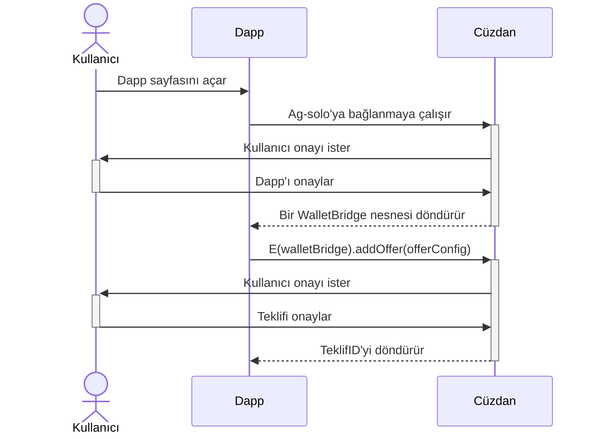

# Ders Beş - REPL ve Dağıtım Scriptleri
## İçindekiler
* `home` nesnesi: REPL mi Dağıtım Scriptleri mi?
  * REPL
  * Dağıtım Scripti
* Dapp Geliştiricileri için `home` Nesnesi
  * Nesnelerinizi elde tutmak: `Board` mu `Scratch` mı?
  * NameHub: `agoricNames`, `namesByAddress`
  * `zoe`!
  * Test olmayan bir ortamda teklifler göndermek: `wallet` ve `walletBridge`
  * Zamanlayıcılar: `localTimerService` mı `chainTimerService` mi?
* Demolar
  * CLI İstemcisi olarak Dağıtım Scripti
  * Başka Bir Kullanıcıya Ödemeler Gönderme

## `home` nesnesi: REPL mi Dağıtım Scriptleri mi?

Kullanıcıları olmayan blockchain ağları işe yaramaz. Kullanıcıyı programlar bağlamında temsil eden bir ajan olmalı. Agoric'te bu ajana `ag-solo` denir. Her `ag-solo`'nun kendi `vat`'i vardır. Bu, diğer `vat`'lerde yaşayan bileşenlerle etkileşime girebilmesinin yolu budur. Genel olarak blockchain ekosistemini düşündüğümüzde, ağdaki kullanıcıları temsil eden ajan `wallet` olarak adlandırılır. Agoric'in kendi cüzdan uygulaması da vardır. Ve evet, bu cüzdan `ag-solo` içinde konuşlandırılmıştır.


_Şekil 1: Ajanların olası yapılandırmalarını gösterir_

Yukarıdaki diyagramda, kullanıcılar kendi `ag-solo`'larında temsil edilir:
* Ag-solo (Alice)
* Ag-solo (Bob)
* Ag-solo (Sam)

Ve bu kullanıcılar bir blockchain ile etkileşime girer, Agoric Blockchain için olası yapılandırmalar şunlardır:
* Sim-Chain
* Yerel Tek Düğüm Zinciri
* Uzaktan Zincir: Ana ağ veya Test ağı

Agoric'te geçirdiğim zamanı dikkate alırsak, bir dapp geliştirici için en iyi geliştirme deneyimi `Yerel Tek Düğüm Zinciri`dir çünkü kodunuzu gerçek bir düğümde çalıştırabilir ve ağla ilgili sorunlarla engellenmezsiniz.

Takip eden derslerde `Yerel Tek Düğüm Zinciri` nasıl başlatılır üzerine odaklanacağız.


### `home` nesnesi nedir?
`home`, `ag-solo`'nun ağı ve diğer kullanıcılarla etkileşim kurmasına izin veren araçlar için kök nesnedir. Bu `home`
nesnesi iki yerden erişilebilir:
1. REPL
2. Dağıtım Scriptleri

### REPL
**R**ead-**E**val-**P**rint-**L**oop - REPL, cüzdan UI'nızın içine entegre edilmiştir. Hatırlayın ki kursun başından beri cüzdan UI'mıza erişmek için aşağıdaki komutu kullandık:

```sh
agoric open --repl
```

Buradaki `--repl` bayrağı, REPL'yi cüzdan UI'mızda erişilebilir hale getirmek istediğimizi gösterir. İşte REPL'den erişilen `home`
nesnesinin bir ekran görüntüsü:


`home` nesnesinde yaşayan bazı nesneler `ag-solo` için dahilidir, bazıları kullanımdan kaldırılmıştır ve bazıları
dapp geliştiricileri için çok yararlıdır. Biz son tip üzerine odaklanacağız.

Hangisinin hangisi olduğuna dair tam bir liste için lütfen [REPL Docs](https://docs.agoric.com/reference/repl/) bakınız.

### Dağıtım Scriptleri
Blockchain ekosisteminde, `dağıtım scripti` terimi, geliştiricilerin akıllı sözleşmelerini üzerinde inşa ettikleri blockchain ağına dağıtmak için kullandığı bir scripti belirtir. Agoric'te bu, bir dağıtım scriptinin yalnızca bir özelliğidir. 

**_Dağıtım scriptlerinin `home` nesnesine tam erişimi vardır._**

Hatırlayın ki `home` nesnesi, dapp geliştiricileri için bir dizi yararlı araç içerir. Dolayısıyla, dağıtım scriptlerini akıllı sözleşmeleri dağıtmak dışında başka amaçlar için kullanmamızın önünde bir engel yok. Bu dersin ilerleyen bölümlerinde bir dağıtım scripti ile ne yapabileceğimizi birkaç canlı demo ile keşfedeceğiz. Şimdilik odaklanalım:

**Bir `dağıtım scripti` ne yapar?**

Agoric CLI'nın `deploy` adında bir alt komutu vardır. Bu dağıtım scripti, argüman olarak istediği kadar script kabul eder ve 
onları sırayla çalıştırır. Örneğin;

```shell
agoric deploy scriptOne.js scriptTwo.js scriptThree.js
```

Yukarıdaki örnek komut, tüm scriptleri aşağıdaki sırayla çalıştırır;
1. scriptOne.js 
2. scriptTwo.js 
3. scriptThree.js

Harika. Ama;

**`agoric deploy` herhangi bir JS scriptini çalıştırabilir mi?**

Hayır, aşağıdaki yapıyı takip etmelidir:

```js
const scriptOne = async (homeP, others) => {
  const home = await homeP;
  console.log({ home, others });
};

export default scriptOne;
```

"`agoric deploy` her betiği iki argümanla çağırır;
1. `homeP`: `home` nesnesi için bir promise
2. `others`: Bizim kontratlarımızı paketlemek için kullandığımız `bundleSource` gibi ve kontratlarımıza yol çözümlemek için kullandığımız `pathResolve` gibi bazı host ile ilgili yardımcı nesneler.

**!!! Önemli !!!:** Eğer `agoric deploy` kullanarak bir betiği çalıştırmak isterseniz, çalıştırmak istediğiniz yöntemi `export default` ile dışa aktarmanız gerekir. Yukarıdaki örnekte, çalıştırmak istediğimiz yöntem `scriptOne` olduğu için, son satıra şunu ekliyoruz;

```js
// ...
export default scriptOne;
```

## Dapp Geliştiriciler için `home` Nesnesi
Daha önce de belirttiğimiz gibi `home` nesnesi birçok araç içerir. Bunlardan bazıları dahili kullanımlar içindir, bazıları agoric-sdk'nin geliştirme aşamasında olduğu için kullanımdan kaldırılmıştır ve bazıları dapp geliştiriciler için çok yararlıdır. Bu yardımcı araçları nasıl kullanabileceğimizi keşfedelim.

### Nesnelerinizi koruma: `Board` vs `Scratch`?
`Hardened JavaScript` bir `OCaps` zorlama ortamıdır. Bu, bir nesnenin referansını bir kere kaybettiğinizde, bu yeteneği de kaybettiğiniz anlamına gelir. `home` nesnesi nesneleri saklama için iki seçenek sunar;

1. Board
2. Scratch

Bir senaryoyu düşünelim ki nesneleri tutmak istiyoruz:

```js
const {
  publicFacet,
  creatorFacet,
  instance,
} = await E(zoe).startInstance(
  installation,
);
```

Ve hayali sözleşmemizde `publicFacet` ve `creatorFacet` içeriği diyelim ki şöyle:

```js
const publicFacet = Far('Public Facet', {
  hello: () => 'Hello from Public Facet!!!',
});

const creatorFacet = Far('Creator Facet', {
  dangerous: () => zcf.shutdown(),
});
```

Genellikle `dangerous` gibi güçlü yöntemlerin `creatorFacet`'te olduğunu bekleriz. Bu yüzden bu hayali kontratın yaratıcısı olarak `creatorFacet`'i korumamız gerekiyor, ama aynı zamanda kullanıcılarımızın `publicFacet` ile etkileşimde bulunmasına izin vermeliyiz. Nesnelerimizi saklayabileceğimiz iki ayrı yere ihtiyacımız var gibi görünüyor;
* **Public Objects** için bir yer
* **Private Objects** için bir yer

Agoric bu ihtiyaçlar için iki depolama yeri sunar: `Board` PUBLIC depolama için ve `Scratch` PRIVATE depolama için.

`home` nesnesini hayali senaryomuz için bir örnek deploy betiğinde kullanmak istesek, aşağıdaki gibi görünür:

```js
const scriptOne = async (homeP, { pathResolve }) => {
  const home = await homeP;

  const {
    publicFacet,
    creatorFacet,
    instance,
  } = await E(zoe).startInstance(
    installation
  );
  
  const [publicFacetBoardId, creatorFacetScratchId] = await Promise.all([
    E(home.board).getId(publicFacet),
    E(home.scratch).set('creator_facet_scratch_id', creatorFacet)
  ]);

  const dappConstants = {
    publicFacetBoardId,
    creatorFacetScratchId
  };
  const defaultsFile = pathResolve(`./generated/dappConstants.js`);
  console.log('writing', defaultsFile);
  const defaultsContents = `\
// GENERATED FROM ${pathResolve('./scriptOne.js')}
export default ${JSON.stringify(dappConstants, undefined, 2)};
`;

  await fs.promises.writeFile(defaultsFile, defaultsContents);
};

export default scriptOne;
```

Kodu incelerken, aşağıdaki bölümde `creatorFacet` ve `publicFacet`'i depoya koyuyoruz:

```js
const [publicFacetBoardId, creatorFacetScratchId] = await Promise.all([
    E(home.board).getId(publicFacet),
    E(home.scratch).set('creator_facet_scratch_id', creatorFacet)
  ]);
```


* `E(home.board).getId(publicFacet)` değeri `board`a ekler (eğer zaten mevcut değilse) ve oluşturulan benzersiz id'yi döndürür,
değer zaten varsa sadece id'yi döndürür. `publicFacet`, `board`da saklandığı için KAMU malıdır.
* `E(home.scratch).set('creator_facet_scratch_id', creatorFacet)` bir anahtar-değer çiftini argüman olarak alır, anahtarı döndürür. 
`creatorFacet`, `scratch`da saklandığı için ÖZEL'dir.

Dokümantasyonu aşağıdaki linklerden inceleyebilirsiniz;
* [Board API Referansı](https://docs.agoric.com/reference/repl/board.html)
* [Scratch Referansı](https://docs.agoric.com/reference/repl/scratch.html#e-home-scratch-set-id-obj)

Nesnelerimizi depoya koyduktan sonra, anahtarları güvenli bir yerde saklamalıyız. Çoğunlukla, bu yerel bir dosyaya yazmak anlamına gelir. 
Yukarıdaki scriptte, dosya adı `dappConstant.js`dir. Bu yerel dosyaya erişimi olan herkes, `Deploy Script`leri ve `REPL`'in aynı `home` 
nesnesini paylaştığı için bu nesneleri REPL'den sorgulayabilir. Örneğin, `publicFacet` için tahta id'si 'board0371' olsun. `publicFacet`, 
**herhangi bir** `ag-solo` tarafından aşağıdaki gibi sorgulanabilir:


Yalnızca `agoric deploy`'a bağlı olan `ag-solo`, `home.scratch`'ın özel olmasından dolayı `creatorFacet`'i sorgulayabilir:


### NameHub: `agoricNames`, `namesByAddress`
`NameHubKit`, kullanıcıların isim hiyerarşisine dayalı olarak nesneleri saklamasına/ sorgulamasına olanak sağlayan, Agoric ekibi 
tarafından uygulanan bir veri yapısıdır.

Bir `NameHubKit`'in iki bileşeni vardır;
* Veri okumak için `NameHub`
* Yazma erişimi için `NameAdmin`

`NameHubKit`'in tam liste metotları, açıklamaları ve kaynak kodunu `NameHubKit Dokümantasyonu` bölümünden incelemeyi unutmayın.

`home` nesnesi, iki `NameHub` örneği sunar: `agoricNames` ve `namesByAddress`,

Ve bir `NameAdmin` örneği: `myAddressNameAdmin`, `namesByAddress` için `NameAdmin`'dir.

#### `agoricNames`
Normal kullanıcıların `agoricNames`'e yazma erişimi olmadığını fark edin. Neden?

`agoricNames`, kullanıcının çekirdek Agoric bileşenlerine erişim elde edebileceği bir `NameHub` özel örneğidir.
Herhangi bir kullanıcının bu kadar önemli bir nesneye yazma izni verilmesi, tüm ağ için bazı güvenlik sorunlarına neden olabilir, 
bu yüzden kullanıcılar `agoricNames` için bir `NameAdmin` alamaz.

**`agoricNames` içinde neler var?**

`agoricNames`'in içeriğini görmek istersek, bunu yapabiliriz:


Bir iç içe geçmiş dizi döndürüldüğünü fark edin, iç dizinin ilk elemanı `anahtar` ve ikinci eleman bir `nameHub` örneğidir. 
Bu, aşağıdaki gibi bir şey yapabileceğimiz anlamına gelir:


Ve `agoricNames`'i sorguladığımız aynı şekilde döndürülen `nameHub`'ı sorgulayabiliriz:


`lookup` metodu, argümanlar olarak bir yol belirlemenize de izin verir, bu yüzden aşağıdaki gibi bir şey mümkündür:


`lookup`'a 3 veya 4 argüman geçirmek mümkündür, burada iç içe geçmiş dizinin seviyesi bu kadar derindir.

#### namesByAddress
`namesByAddress` de bir `NameHub` örneğidir ancak ağ genelinde çekirdek bileşenlere erişim için değil, kullanıcının kişisel 
depolaması için. `myAddressNameAdmin`'dan kendi ag-solo'nuz için `NameAdmin`'e erişebilirsiniz. Bir örnek senaryo üzerinden gidelim;

> **Önemli:** Burada not edilmesi gereken önemli bir şey, kullanıcıların tüm diğer kullanıcıların `NameHub`larını görebilmeleri ancak 
> sadece kendi `NameHub`larına yazabilmeleridir. Bu, `NameHub`'ların iç içe geçmiş yapısı sayesinde mümkündür.

Alice'nin, yalnızca Bob ile paylaşmak istediği önemli bir nesnesi olduğunu hayal edin. Agoric bir OCaps ortamı olduğundan 
bu çok olası bir senaryodur. Bu önemli nesnenin referansını Bob ile nasıl paylaşabilir?

Bu amaç için uygulanmış bir akıllı kontratın olduğunu varsayalım, ki bu da çok olasıdır, kaynak kodu aşağıdaki gibi olsun:

```js
const start = () => {
  const importantObjects = [];

  const creatorFacet = Far('Important Object Receiver', {
    receiveNew: newImportantObject => {
      importantObjects.push(newImportantObject

Aşağıdaki kodun Türkçe çevirisi;

```js
const start = () => {
  const importantObjects = [];

  const creatorFacet = Far('Önemli Nesne Alıcı', {
    receiveNew: yeniÖnemliNesne => {
      importantObjects.push(yeniÖnemliNesne);
    },
    readImportantObjects: () => {
      return [...importantObjects];
    }
  });

  return { creatorFacet };
};
```

Yukarıdaki kontratta yalnızca `creatorFacet`'i açığa çıkarıyoruz çünkü sadece Bob'un adresini bilen kişilerin Bob ile nesneleri 
paylaşabilmelerini sağlamak istiyoruz. Bob bu kontratı başlatacak ve `creatorFacet`'i `nameHub`'ına koyacak. Bu işlemi tek seferde 
bir dağıtım scripti ile yapabilir. Bir dağıtım scripti örneği aşağıdaki gibi olabilir:

```js
const shareImportantObject = async (homeP , endowments) => {
  const { myAddressNameAdmin, zoe } = E.get(homeP);
  const { install } = await makeHelpers(homeP, endowments);

  console.log('Installting objectReceiver contract...');
  const { installation } = await install(
    '../../contract/src/lectureFive/objectReceiver.js',
    'Object Receiver Contract'
  );

  console.log('Starting objectReceiver contract...');
  const {
    creatorFacet: objectReceiverCreatorFacet
  } = await E(zoe).startInstance(
    installation
  );

  console.log('Putting objectReceiverCreatorFacet to namesByAddress...');
  await E(myAddressNameAdmin).update('objectReceiver', objectReceiverCreatorFacet);

  console.log('Done.');
};

export default shareImportantObject;
```
**Not:** [Dağıtım betiğinin kaynak kodu.](../codeSamples/api/lectureFive/shareImportantObject.js)

**Dikkat:** `E.get()` bir Promise'den nesne çekmeyi, çözülmesini beklemeksizin sağlar.

**Dağıtım betiği ne yapıyor?**

Kaynak koddaki **23. satıra** kadar olan kod, kontratın yüklenmesi ve örneğin başlatılması içindir. 
[deploy-script-support](https://github.com/Agoric/agoric-sdk/tree/65d3f14c8102993168d2568eed5e6acbcba0c48a/packages/deploy-script-support) başlığını kontrol edin.

İlgilendiğimiz kısım:

```js
console.log('NesneAlıcıYaratıcıFacet isimliAdreslere ekleniyor...');
await E(myAddressNameAdmin).update('objectReceiver', objectReceiverCreatorFacet);
```

Dikkat edin;
* Dağıtım betiği `myAddressAdmin` ile aynı `vat`'te olmadığı için [eventual-send](https://github.com/endojs/endo/tree/master/packages/eventual-send)(E)'yi kullanıyoruz.
* Yeni bir nesneyi başlatmak için `update` metodu kullanılır.
* `console.log` aracılığıyla Bob'a ne yaptığımızı bildiriyoruz.

Yukarıdaki betik çalıştırıldığında, Bob'un adresini bilen herkes onunla nesneleri paylaşabilir. REPL'den paylaşılan nesneyle etkileşim kurmak aşağıdaki gibi görünebilir:

> **Not:** Bir simülasyon zinciri başlattım, dolayısıyla kullanıcının adresi `sim-chain-client`'ta.

> **Not:** Simülasyon zincirindeyiz, bu yüzden hem Bob hem de Alice gibi davranıyoruz.

`objectReceiver`'ı sorgulayın;


İçerikleri kontrol edin;


`topSecret` oluşturun ve Bob'a gönderin;


`topSecret`'ı alın ve füzeleri fırlatın;


Bu şekilde diğer kullanıcılara özel bir şekilde nesneler gönderebilirsiniz. Canlı demoda diğer kullanıcılara nasıl ödeme gönderileceğini göstereceğiz.

#### NameHubKit Dokümantasyonu
* [NameHub API Referansı](https://github.com/Agoric/agoric-sdk/blob/65d3f14c8102993168d2568eed5e6acbcba0c48a/packages/vats/src/types.js#L14-L30)
* [NameAdmin API Referansı](https://github.com/Agoric/agoric-sdk/blob/65d3f14c8102993168d2568eed5e6acbcba0c48a/packages/vats/src/types.js#L32-L57)
* [NameHubKit Kaynak Kodu](https://github.com/Agoric/agoric-sdk/blob/65d3f14c8102993168d2568eed5e6acbcba0c48a/packages/vats/src/nameHub.js)

### `zoe`!
Hatırlayın ki `zoe`'nin iki yüzü vardır;
1. `ZoeService` çoğunlukla müşteri amaçları içindir
2. `ZoeContractFacet` akıllı kontrat geliştiricileri için bir araç seti sunar

REPL ve Dağıtım Betikleri bağlamında düşündüğümüzde, bizim müşteri tarafında olduğumuz açıktır. Bu, `home` nesnesinin bize `zoe` olarak sunduğu şeyin aslında `ZoeService` olduğu anlamına gelir. Tüm [ZoeService API Referansı](https://docs.agoric.com/reference/zoe-api/zoe.html)'na göz atmakta özgürsünüz. `ZoeService` API'deki tüm metodlar hem REPL hem de Dağıtım Betiklerinde çalışır. Ben sadece sık kullanılan birkaç metoda değinmek istiyorum:


_Figure 2: Zoe'nin Dağıtım Betiklerinde ve REPL'de sıkça kullanılan metodları gösterir_

`Zoe`, Agoric Ağı için kontrat hostudur ve bu hosta konuşlandırılan tüm kontratlar aynı şekilde yapılmalıdır. İki ana metot vardır:

1. `E(home.zoe).install()`
2. `E(home.zoe).startInstance()`


Aşağıdaki kodları ve açıklamalarını satır satır Türkçe'ye çevirelim:

Bir sözleşmeyi başarıyla yüklediğimiz ve örneklendirdiğimizde, sözleşmenin örneğine referansla birkaç işlem yapabiliriz:

1. `E(home.zoe).getBrands(instance)` ve `E(home.zoe).getIssuers(instance)` 
2. `E(home.zoe).getTerms(instance)`
3. `E(home.zoe).getPublicFacet(instance)`

Tüm [ZoeService API Referansı'nı](https://docs.agoric.com/reference/zoe-api/zoe.html) incelemeyi unutmayın.

### Test olmayan bir ortamda teklif gönderme: `wallet` ve `walletBridge`
Teklif Güvenliği, Agoric'in sunduğu değer açısından en önemli yönlerden biridir.
Şimdiye kadar teklif göndermenin sadece bir yolunu gördük, o da;

```js
const userSeat = await E(zoe).offer(
  invitation,
  proposal,
  payment,
  offerArgs, // İsteğe bağlı
);
```

* **invitation:** `offerHandler`a bir referans tutar, gerekli
* **proposal:** Kullanıcı ne istediğini ve karşılığında ne ödemeye hazır olduğunu belirtir, teklifte bir hak transferi olacaksa gerekli
* **payment:** Kullanıcının gerçekten ödediği varlık, teklifte `give` özelliği varsa gerekli
* **offerArgs:** İş mantığına özgü veri, isteğe bağlı

Bazı `Moola` fungible varlıklarını, belirli bir miktar `Quatloos` fungible varlık karşılığında almak istediğimiz bir senaryo hayal edelim. Aşağıdaki gibi bir birim testinde ilgili teklifi gerçekleştirebiliriz:

```js
const {
  brand: quatloosBrand,
  mint: quatloosMint
} = makeIssuerKit('Quatloos');

const quatloosAmount = AmountMath.make(quatloosBrand, 100n);
const moolaAmount = AmountMath.make(moolaBrand, 200n);

const proposal = {
  give: { Price: quatloosAmount },
  want: { Asset: moolaAmount }
};

const payment = {
  Price: quatloosMint.mintPayment(quatloosAmount),
};

const userSeat = await E(zoe).offer(
  E(publicFacet).makeAssetInvitation(),
  proposal,
  payment,
);
```

Gereken ödemeyi `quatloosMint.mintPayment(quatloosAmount)` çağırarak oluşturduğumuzu fark edin. Bu, gerçek bir ağ ortamında mümkün olabilir mi? Hayır, mümkün değil. Eğer mümkün olsaydı, bu paranın basıldığı anlamına gelirdi. Bunu engelleyen teknik bir sebep olmasa da, basabileceğiniz bir varlığı insanların alışveriş yapacak olmaları çok uzak bir ihtimal. Peki, ödeme nasıl elde edilir?

**İşte burada `home.wallet` devreye girer**

Daha önceki bölümlerde elektronik bir hakkı, ERTP arayüzünü uygulayarak bir e-hakkına nasıl dönüştürebileceğimizden bahsetmiştik. ERTP şunları içerir;

* Emitent (Issuer)
* Para Basımı (Mint)
* Cüzdan (Purse)

Ve liste böyle devam eder. Tam belgelendirme için [ERTP API Referansı'nı](https://docs.agoric.com/reference/ertp-api/) gözden geçirin.
`wallet` nesneleri, kullanıcı açısından ERTP API'nın en önemli bileşenlerine erişim sağlar. Özellikle;
* **Purse (Cüzdan):** Ödemelerin saklandığı yer.
* **Payment (Ödeme):** Gerçek para.

İlgili metotlar aşağıdaki gibidir;
* `E(home.wallet).addPayment(payment)`
* `E(home.wallet).getIssuers()`
* `E(home.wallet).getIssuer(petname)`
* `E(home.wallet).getPurses()`
* `E(home.wallet).getPurse(petname)`
  
> Not: [Petname'nin tanımı](https://docs.agoric.com/glossary/#petname)

Tüm yöntemlerin tam listesi için [Cüzdan API Referansı](https://docs.agoric.com/reference/wallet-api.html#wallet-api-commands)'na bakınız.

`home.wallet` objesini kullanarak bu istenen teklifi bir dağıtım script'inden göndermeyi deneyelim;

```js
/**
 * Şunu varsayıyoruz;
 * - Tüm tahta id'leri zaten bilinmektedir
 * - Tüm petname'ler bilinmektedir
 */
const sendOfferUsingWalletAPI = async homeP => {
  const { zoe, board, wallet } = E.get(homeP);
  const quatloosPursePetname = 'Quatloos Cüzdanı';
  const moolaPursePetname = 'Moola Cüzdanı';
  
  // Değerleri tahtadan al
  const [
    quatloosMarka,
    moolaMarka,
    publicFacet, // Ticareti yapacak hayali sözleşmenin Kamu Yüzü
  ] = await Promise.all([
    E(board).getValue(QUATLOOS_BRAND_BOARD_ID),
    E(board).getValue(MOOLA_BRAND_BOARD_ID),
    E(board).getValue(PUBLIC_FACET_BOARD_ID),
  ]);
  
  // Teklifi oluştur
  const quatloosAmount = AmountMath.make(quatloosMarka, 100n);
  const moolaAmount = AmountMath.make(moolaMarka, 200n);
  
  const proposal = harden({
    give: { Price: quatloosAmount },
    want: { Asset: moolaAmount }
  });
  
  // Cüzdanları al
  const quatloosPurseP = E(wallet).getPurse(quatloosPursePetname);
  const moolaPurseP = E(wallet).getPurse(moolaPursePetname);
  
  // Ödemeyi al
  const quatloosPayment = await E(quatloosPurseP).withdraw(quatloosAmount);
  
  const payment = harden({
    Price: quatloosPayment
  });
  
  const userSeat = E(zoe).offer(
    E(publicFacet).makeAssetInvitation(),
    proposal,
    payment
  );
  
  // Teklifin başarılı olduğundan emin ol, bu teklifin gerçekleştirilmesinde yakalanmayan bir hata olduğunda hata verir
  await E(userSeat).getOfferResult();
  
  // Ödemeyi al
  const moolaPayment = await E(userSeat).getPayout('Asset');
  
  // Moolayı cüzdana koy
  await E(moolaPurseP).deposit(moolaPayment);
};

export default sendOfferUsingWalletAPI;
```

Yukarıdaki kodu adım adım açıklayalım;
1. Gerekli objelere `tahta`dan referansları alıyoruz
2. `Amounts` ile teklifi oluşturuyoruz
3. Cüzdanımızdan istenen varlıklara ilişkin cüzdanları alıyoruz
4. Teklifimizin `give` kısmında belirttiğimiz `quatloos` miktarını `quatloosCüzdanı`ndan çekiyoruz
5. Ödemeyi oluşturuyoruz
6. Teklifi gönderiyoruz
7. Her şeyin yolunda gittiğini kontrol ediyoruz
8. İstediğimizi `userSeat`ten çekiyoruz
9. Çekilen `moola`yı `moolaCüzdanı`na yatırıyoruz

Yukarıdaki koddaki bir anti-paterni fark edebiliyor musunuz? "Hiçbir geliştiricinin kodda herhangi bir ödeme üzerinde kontrolü olmamalı" ne oldu? Evet, burada bir şeyler yanlış. Bu, demo'lar için yararlı bir yaklaşım olabilir, ancak bu bir üretim yaklaşımı değil. Peki çözüm ne?

**`walletBridge`'e hoş geldiniz**

`walletBridge`, güvenilmeyen dapp'ların cüzdanla ve dolayısıyla cüzdanındaki varlıklarla etkileşime girmelerine izin veren bir API sağlar. Kullanılabilir tüm yöntemlerin tam listesi için [WalletBridge API Referansı](https://docs.agoric.com/reference/wallet-api.html#walletbridge-api-commands)'na bakınız.

Web3'te, hemen hemen her dapp, kullanıcının cüzdanını bağlamasını ister. Agoric'te durum aynıdır. Dapp'lar, işlerini yapabilmeleri için kullanıcılardan onay ister. Bir dapp'ı onaylamak demek;
* O dapp için özel bir `walletBridge` örneği oluşturulur ve dapp'a geri döndürülür
* Kullanıcının cüzdanı artık dapp'ı tanıyor

`bridge` terimi, `home.wallet`'ın tüm özellikleri ve dapp arasında olduğu için kullanılır. `walletBridge` üzerinden gönderilen her teklif kullanıcının onayına tabidir. Bu teklif istekleri, Cüzdan UI'nın `Dashboard`'unda görünür. Uçtan uca akış, aşağıdaki diyagramda görülebilir:




```js
/**
 * Şunu varsayıyoruz;
 * - Tüm board id'leri zaten biliniyor
 * - Tüm petname'ler biliniyor
 */
const guvenliTeklifMusterisi = async homeP => {
  const { board, wallet } = E.get(homeP);
  const quatloosPursePetname = 'Quatloos Purse';
  const moolaPursePetname = 'Moola Purse';
  
  const publicFacetP = E(board).getValue(PUBLIC_FACET_BOARD_ID);
  const walletBridge = E(wallet).getBridge();
  
  const teklifKonfigurasyonu = {
    id: `${Date.now()}`,
    invitation: E(publicFacetP).makeBorrowInvitation(),
    installationHandleBoardId: IMAGINARY_CONTRACT_INSTALL_BOARD_ID,
    instanceHandleBoardId: IMAGINARY_CONTRACT_INSTANCE_BOARD_ID,
    proposalTemplate: {
      want: {
        Asset: {
          pursePetname: moolaPursePetname,
          value: 200n,
        },
      },
      give: {
        Price: {
          pursePetname: quatloosPursePetname,
          value: 100n,
        },
      }
    },
  };
  
  await E(walletBridge).addOffer(teklifKonfigurasyonu);
  console.log('Teklif gönderildi.');
};

export default guvenliTeklifMusterisi;
```

Bu scripti `agoric deploy` ile çalıştırdığımızda, yukarıdaki kod daha önceki örnekte gönderdiğimiz teklifi aynen gönderir. Fark edin;
* Herhangi bir `payment` uçuşmuyor
* OfferHandler, kullanıcının Wallet UI'dan teklif isteğini onaylamasının ardından çalıştırılacak

Belirtilecek bir şey daha var:

```js
const walletBridge = E(wallet).getBridge();
```

Yukarıdaki satırda, `getBridge` metodunu kullanarak `walletBridge`'i çektik. Belgelerde, gerçek dünya senaryosunda bir dapp'ın kullanacağı `getScopedBridge` adlı bir metodun da olduğunu göreceksiniz. `getBridge` ile `getScopedBridge` arasındaki fark, `E(wallet).getScopedBridge()`'in kullanıcı onayı gerektirmesi, `E(wallet).getBridge()`'in ise gerektirmemesidir. Dağıtım scriptlerinin güvenilir ajanlar olarak kabul edildiği için `getBridge`'i kullanabildik, eğer bir tarayıcıda yaşayan bir dapp olsaydık ve cüzdanımızdan bir `walletBridge` örneği almaya çalışırsak, bunun yerine `getScopedBridge`'i kullanmak zorunda kalırdık.

**Dağıtım Scriptleri Müşteri Uygulamalarını Taklit Edebilir**
`wallet` kullanımıyla, bir GUI oluşturmadan kontratlarınızı bir birim-test-olmayan-ortamda test edebilirsiniz. Demolar için çok kullanışlı bir özellik.

### Zamanlayıcılar: `localTimerService` mi `chainTimerService` mi?
Agoric, ağın tüm ajanları arasında paylaşılan bir zaman hizmeti sunar. Zamanın geçişine bağlı bir iş yapan tüm taraflar, herkes için zamanın aynı şekilde geçtiğinden emin olmak için bu hizmeti kullanabilir.

Bu paylaşılan zaman hizmeti `chainTimerService` olarak adlandırılır. Agoric ayrıca çoğunlukla testler için kullanılan `localTimerService`'i sunar. Bu zaman hizmetleri her ikisi de aynı API'yi paylaşır. Aralarındaki tek fark _zaman birimidir_:

* `localTimerService` zamanı **milisaniye** cinsinden yorumlar.
* `chainTimerService` zamanı **saniye** cinsinden yorumlar.

[Zaman hizmetleri üzerine tam belgelere buradan bakabilirsiniz.](https://docs.agoric.com/reference/repl/timerServices.html#timerservice-objects)

Zaman bağımlılığı olan bir akıllı kontrat geliştirirken, genellikle yapılacak yol, kontrat koşullarından bir `timer` kabul etmektir:

```js
const basla = async zcf => {
  const {
    timer,
  } = zcf.getTerms();
};

harden(basla);
export { basla };
```

Ve dağıtım scriptinizde istediğiniz zaman hizmetini kontratınıza enjekte edebilirsiniz:

```js
const deploy = async homeP => {
  const { zoe, localTimerService, chainTimerService } = E.get(homeP);
  
  const sampleTermsOne = {
    timer: localTimerService
  };
  
  const sampleTermTwo = {
    timer: chainTimerService,
  };
  
  await E(zoe).startInstance(
    installation,
    issuerKeywordRecord,
    sampleTermsOne      
  );

  await E(zoe).startInstance(
    installation,
    issuerKeywordRecord,
    sampleTermsTwo
  );
};

export default deploy;
```

Her iki terim de geçerlidir ve kontratınız tarafından kullanılabilir.

Çok kullanışlı olan bir [manualTimer](https://github.com/Agoric/agoric-sdk/blob/65d3f14c8102993168d2568eed5e6acbcba0c48a/packages/zoe/tools/manualTimer.js) var. Bunu kontrol ettiğinizden emin olun.

## Demo Zamanı!
* CLI Müşterisi olarak Dağıtım Scripti
* Diğer kullanıcılara özel davetiyeler gönderme

