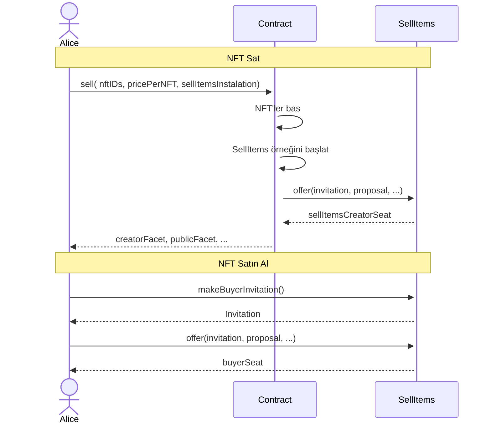

# Ders Dört - Ödev

## Ödev Açıklaması:

1. Yeni bir sözleşme oluşturun;
2. Bazı NFT'ler basın;
3. Kullanıcının bazı basılmış NFT'leri Zoe sellItems sözleşmesi aracılığıyla satmasına izin veren bir fonksiyon oluşturun;
4. Yukarıdaki sözleşme için yeni bir test dosyası oluşturun;

## Sıralı diyagram

