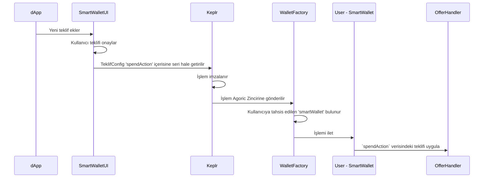
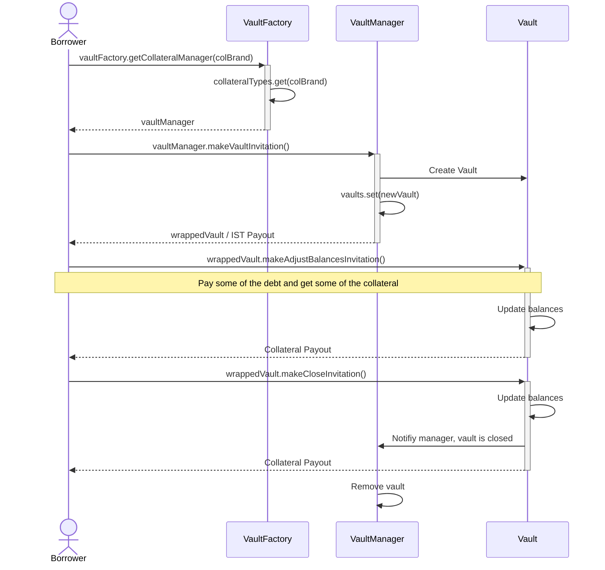
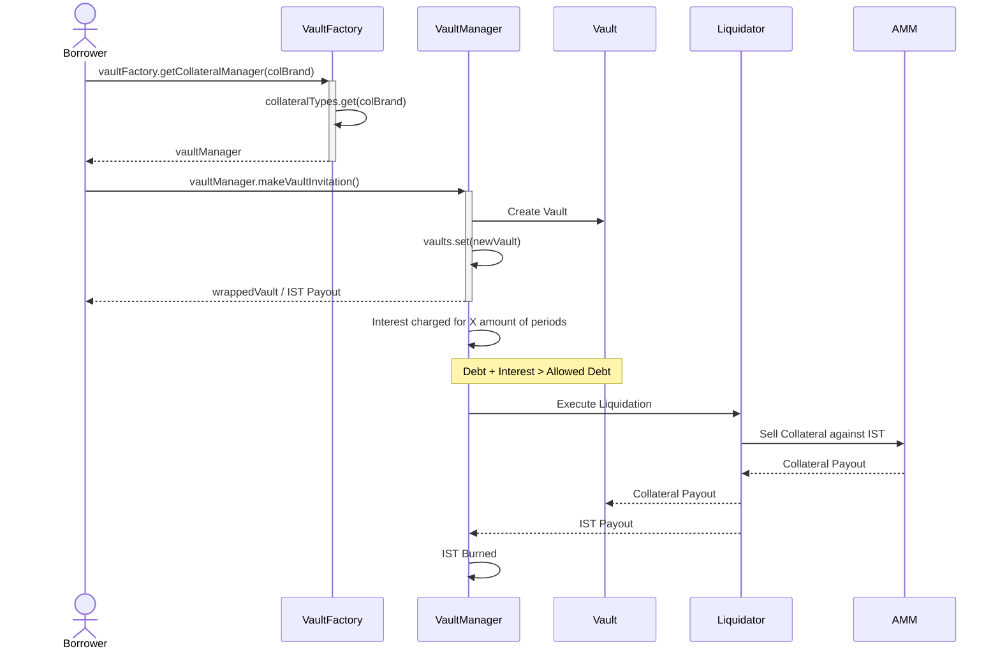

# Dokuzuncu Ders - Inter Protokol
## İçindekiler
* Giriş
  * IST nasıl stabilitesini korur?
* Inter Protokol ile Etkileşim
  * Akıllı Cüzdan
* IST Basma Bileşenleri
  * PSM
  * VaultFactory
  * BLD Boost
* Likidite Güvenceleri
  * AMM
  * Rezerv

## Giriş
Agoric, kendini Cosmos ekosisteminin tamamında eşsiz bir yere konumlandırmayı hedefliyor. Plan, ABD dolarına yumuşak bir şekilde bağlı, yerel IBC uyumlu token olan Inter Stable Token (IST) sunmaktır. Inter Protokol, IST çevresinde Agoric Ekonomisini uygulayan merkeziyetsiz bir uygulamadır.

### Nasıl çalışır?
Inter Protokol, birden fazla uygulama için temel bir terimdir. Aşağıdaki diyagram, bu uygulamaların IST'nin basılması/yakılması işlemini nasıl birlikte gerçekleştirdiğini göstermektedir.


> _Şekil 1: [Inter Protokol Sistem Genel Bakış](https://docs.inter.trade/inter-protocol-system-documentation/inter-protocol-system-overview)_

Inter Protokol şu anda sadece diyagramdaki `PSM` ve `Akıllı Cüzdan` ile `Mainnet 1` üzerinde canlıdır. 
Gelecek lansmanlar için [Agoric Yol Haritası](https://agoric.com/roadmap/)'na göz atın. [Inter Protokol](https://inter.trade/)
'ün şu anki sürümü, kullanıcıların `PSM` içinde IST'ye karşı stable token alıp satmasına olanak sağlar. Bu işlem `Akıllı Cüzdan` ve [Keplr](https://www.keplr.app/) kullanılarak gerçekleştirilir.

Agoric, modelini [Maker DAO](https://makerdao.com/en/)'ya benzer bir şekilde benimser. Bu, IST'nin kripto varlıklarla tamamen teminatlandırıldığı anlamına gelir. Dolayısıyla, tamamen merkeziyetsizdir. Teminatlandırma stratejisi, çoğu protokolün kripto dünyasındaki gibi, yani aşırı teminatlandırılmıştır. `Likidasyon Marjı`, istenen IST'ye kıyasla teminatın ABD Doları değerinin ne kadar büyük olması gerektiğini hesaplamaya yardımcı olan bir parametredir.

`Ekonomik Komite`, Agoric Ekonomisi için kritik öneme sahip yönetim parametreleridir. Bu parametreler şunları içerir:
* Borç Limitleri
* Faiz Oranları
* Teminatlandırma Oranı

Ve benzeri...

`Ekonomik Komite`ye kimler girer? İşte bu bağlıdır. `Ekonomik Komite`nin üyeleri `BLDer DAO` tarafından seçilir. `BLDer DAO`, `BLD` pay sahiplerini temsil eden bir genel terimdir. Bu `Ekonomik Komite`nin kodu, `governance` paketi altında bakımı yapılan [committee.js](https://github.com/Agoric/agoric-sdk/blob/master/packages/governance/src/committee.js) dosyasında bulunabilir.

> Unutmayın, daha fazla bilgi için [Inter Protokol Beyaz Kağıdı](https://inter.trade/static/whitepaper-6106f841c1ed6c564afd2fc3238240a9.pdf)
> 'na göz atın.

### IST nasıl stabilitesini korur?

**`Stable Token` nedir?**

**`Stable Token` Tipleri**

**Stabiliteyi Koruma**

## Inter Protokol ile Etkileşim
### Akıllı Cüzdan
Eğer _Şekil 1_'e bakarsanız, `Akıllı Cüzdan`ın kullanıcıların `inter-protokol` dapp'lerine giriş kapısı olduğunu görebilirsiniz.
Ama şimdiye kadar Agoric Ağı ile hep `ag-solo` kullanarak etkileşime girdik, neden `Akıllı Cüzdan` o zaman? Fark edin ki 
`ag-solo` çok güçlü nesnelere erişimi olan off-chain bir `vat`'tır. 
Dolayısıyla, `Akıllı Cüzdan` için motivasyonlar şunlar olabilir;

* Bu kadar güçlü nesneleri normal kullanıcılara maruz bırakmamalıyız
* Her kullanıcı, Agoric Blockchain'le etkileşime girmek için kendi `ag-solo`'sunu çalıştıramaz

> Not: `ag-solo` DevNet'te hala kullanılabilir ama `MainNet` için `Akıllı Cüzdan` kullanmalısınız

Aşağıdaki diyagram, `Akıllı Cüzdan` yaklaşımını mevcut `ag-solo` yaklaşımıyla karşılaştırır


> _Şekil 2: SmartWallet vs ag-solo. [Orijinal Diyagram.](https://github.com/Agoric/documentation/issues/726#issue-1442404880)_

Burada not edilmesi gereken birkaç şey;

* `Akıllı Cüzdan`, iki ana bileşenden oluşur
  * On-chain akıllı sözleşmeler ve yardımcı kod
  * Off-chain ist

emci kod: `SmartWalletUI`
    > [Akıllı Cüzdan Sözleşme Kodu](https://github.com/Agoric/agoric-sdk/tree/master/packages/smart-wallet) ve [Akıllı Cüzdan UI Kodu](https://github.com/Agoric/wallet-app)

On-chain `Akıllı Cüzdan Sözleşmeleri`nin aşağıdaki ana sorumlulukları vardır;
* `bank` adı verilen özel bir nesne aracılığıyla kullanıcının bakiyeleriyle ilgilenmek
* Dapp'lardan gelen teklif taleplerini gerçek teklifHandler'a iletme

> Daha fazla öğrenmek için [bank kodu](https://github.com/Agoric/agoric-sdk/blob/f41a6ce8975e5bf713734425189946e9d38d1f3f/packages/vats/src/vat-bank.js#L204) ve [Akıllı Cüzdan nasıl çalışır?](https://github.com/Agoric/agoric-sdk/discussions/6934)
> tartışmasına göz atın.

Aşağıdaki sıralı diyagram, _Şekil 2_'deki akışı daha fazla detayla gösterir:


Gördüğünüz gibi `Zincir İçi Akıllı Cüzdan Sözleşmeleri` iki bileşene ayrılmıştır;
1. WalletFactory
2. SmartWallet

`WalletFactory` ve `SmartWallet` arasındaki ilişki aşağıda gözlemlenebilir:


## IST Basma Bileşenleri

### PSM
Parity Stability Module (PSM), MakerDAO'nun [The Peg Stability Module](https://mips.makerdao.com/mips/details/MIP29#sentence-summary) 
konseptine benzer. Temel fikir, diğer stabil paralar karşılığında 1:1 oranında IST basmaktır. BLD staker yönetimi, hangi 
stabilcoinlerin teminat olarak kabul edileceğine karar verir. Belirli bir `PSM` örneği için, yani bir tür stabilcoin karşılığında IST basan bir piyasa için, `Ekonomi Komitesi` aşağıdaki parametreleri de yönetir;
 
* GiveMintedFee
* MintLimit
* WantMintedFee

Bu parametreler, `PSM` modülünden IST almak/vermek için `Ücretler`dir ve diğeri bu `PSM` örneğinin basabileceği IST toplam miktarıdır.

#### Fikir
`PSM` arkasındaki fikir, IST fiyatı Amerikan dolarından saparsa arbitraj fırsatları sunarak IST'nin stabilitesini korumaktır. Bu arbitraj mekanizması aşağıda gösterilmiştir;

> Aşağıdaki diyagramda kullanılan sayılar keyfi olarak seçilmiştir


#### Geliştiriciler için
`PSM`'ye kendi dapp'lerini entegre etmek isteyen üçüncü taraf geliştiriciler, `PSM Public Facet`'e göz atmayı düşünebilir;

```js
// PSM publicFacet
const publicFacet = {
  getMetrics() {},
  getPoolBalance() {},
  makeWantMintedInvitation() {},
  makeGiveMintedInvitation() {},
  ...publicMixin,
}
```
Stabletoken'ınız karşılığında IST istediğinizde `makeWantMintedInvitation` kullanın ve IST'niz karşılığında stabletoken'ınızı istediğinizde `makeGiveMintedInvitation` kullanın. Bu davetiyelerin kullanımı, şimdiye kadar gördüğümüz gibidir.

```js
const invitation = E(psmPublicFacet).makeWantMintedInvitation();

const proposal = harden({
  give: { Anchor: anchorAmount },
  want: { Minted: mintedAmount },
});

const payment = harden({
  Anchor: anchorPayment
});

const userSeat = E(zoe).offer(
  invitation,
  proposal,
  payment,
);

await E(userSeat).getOfferResult();
const istPayment = await E(userSeat).getPayout('Minted');
```

**PSM Örnekleri**

[publicMixin](https://github.com/Agoric/agoric-sdk/blob/65d3f14c8102993168d2568eed5e6acbcba0c48a/packages/governance/src/contractHelper.js#L184-L187) 
yönetilen parametreler için yardımcı metotlar kümesidir. `PSM`, parametrelerini yönetmek için bir yardımcı kullanır.

[want stable](https://github.com/Agoric/agoric-sdk/blob/65d3f14c8102993168d2568eed5e6acbcba0c48a/packages/inter-protocol/test/smartWallet/test-psm-integration.js#L123-L172)
testi `inter-protocol/test/smartWallet/test-psm-integration.js` içinde `PSM`'nin bir `Akıllı Cüzdan` ile nasıl kullanılabileceğini gösterir.

[test-psm.js](https://github.com/Agoric/agoric-sdk/blob/65d3f14c8102993168d2568eed5e6acbcba0c48a/packages/inter-protocol/test/psm/test-psm.js)
`PSM` ile ilgili daha fazla kullanım durumu içerir. `PSM`'nin özelliklerini sergileyen önemli test;

* [limit is for minted](https://github.com/Agoric/agoric-sdk/blob/65d3f14c8102993168d2568eed5e6acbcba0c48a/packages/inter-protocol/test/psm/test-psm.js#L341-L364)<br>
  Bu test, 1 anchor coin karşılığında 2 IST'lik bir `PSM` oluşturur. Ve `MINT_LIMIT` miktarında anchor ile `PSM` ile ticaret yapmak ister. Bu işlem, 2 * `MINT_LIMIT` kadar IST basmayı gerektirir, bu yüzden `'Request would exceed mint limit'` mesajı ile hata verir.
Bu, önemli olanın anchor miktarı değil, sözleşmenin sınırlamaya çalıştığı IST miktarı olduğunu gösterir.
* [mix of trades: failures do not prevent later service](https://github.com/Agoric/agoric-sdk/blob/65d3f14c8102993168d2568eed5e6acbcba0c48a/packages/inter-protocol/test/psm/test-psm.js#L374-L464)<br>

Bu test için, bir diziden alım satımı etkinleştirmek için yardımcı metotlar uygulanmıştır. Temelde görmek istediğimiz şey, bir alım satımın başarısız olması durumunda diğerlerinin beklenildiği gibi işlev görmeye devam edip etmeyeceği.

### VaultFactory
`VaultFactory`, IST satın almak için başka bir alternatiftir. IST tamamen teminatlandırılmış bir stablecoin olduğundan, kullanıcılar sadece IST'yi bazı teminatlar karşılığında takas edebilir. `VaultFactory`, bu anlamda `PSM`'ye benzer. Fark, kabul edilen teminat türünde yatar. `VaultFactory`, BLD staker yönetiminin onay vermesi koşuluyla her türlü ERTP varlığını teminat olarak kabul edebilirken, `PSM` yalnızca stablecoinleri kabul eder. Bu önemli fark, `aşırı teminatlandırma` olarak adlandırılan diğer büyük bir farklılığa neden olur. `PSM`, diğer stablecoinlerle 1:1 oranında işlem yapar, yani teminatın değeri, alınan IST değeri ile eşittir. Kripto varlıkların çok dalgalı olabilmesi nedeniyle, başka bir kripto varlıkla 1:1 oranında IST basmak IST'nin değerini riske atardı. Unutmayın, IST tamamen teminatlandırılmış bir varlık, bu yüzden yüksek miktarda IST'yi desteklemek için yeterli teminat olduğundan emin olmak istiyoruz. `VaultFactory`, bu sözde `değeri` teminatın ABD doları cinsinden ölçer. Bu, IST'nin istikrarını destekleyen başka bir mekanizmadır.

`VaultFactory`'nin tam olarak nasıl çalıştığını anlamak için öncelikle birkaç terimi anlamamız gerekiyor:

* **Likidasyon Marjı:**
  Teminatın USD değerinin borcun USD değerinden daha yüksek olması gerektiğini söyledik. Peki, ne kadar fazla olmalı? `Likidasyon Marjı` bu marjı belirtir. Diyelim ki 100 IST ödünç almak istiyorsunuz ve `Likidasyon Marjı` %150 ise, istediğiniz IST'yi ödünç alabilmek için en az 150 dolar değerinde teminat koymalısınız.
* **Likidasyon:**
  Yukarıdaki örneği devam ettirelim. Şimdi, 150 dolar değerinde teminat karşılığında 100 IST ödünç aldığınızı düşünün. Teminat tokeninizin değeri USD karşısında düşerse ve şimdi kasada sadece 125 dolarlık teminatınız varsa ne olur? `Likidasyon Marjı` %150 olduğunda, 125 dolarlık teminat için en fazla ne kadar IST ödünç alabilirsiniz? Cevap: `125 / 1.5 = 83,3`. Sizde ne kadar IST var? `100 IST`. Böyle bir durumda, `Inter Protokolü` bu tür bir krediyi `yetersiz teminatlandırılmış` olarak kabul eder ve daha fazla zarar olmadan önce harekete geçer. Bu eylem: <ins>Borçlunun teminatını başka bir pazarda IST karşılığında satmak ve satın alınan IST'yi yakmaktır.</ins> Böylece, teminatsız hiçbir IST kalmaz. Bu eyleme `Likidasyon` denir.
* **Faiz Oranı:**
Her kasaya bir faiz yüklenir. Gerçek dünyaya benzer bir şekilde.
* **Şarj Dönemi ve Kayıt Dönemi:** `VaultFactory` kodunu incelediğinizde, bu iki zamanla ilgili benzer parametreyi fark edeceksiniz. Her `Şarj Dönemi`nde faiz yüklenir. Bir şarjda biriken faiz miktarı çok küçük olduğundan, sistem anlamlı bir miktar birikene kadar beklemeyi ve sonra dış dünyaya göstermeyi seçer. Biriken faizleri gösterme bu döneme `Kayıt Dönemi` denir.

#### VaultFactory Temel Tasarım


`VaultFactory`, `collateralBrand`'in anahtar ve `vaultManager`'ın değer olduğu bir anahtar-değer yapıdaki `VaultManager`'ları saklar. Yeni `vaultManager`'ları oluşturma yeteneği `VaultFactory'nin` creatorFacet'ine aittir ve bu `Ekonomik Komite` tarafından kontrol edilir.

Kullanıcıların gerçekte IST ödünç aldıkları yer `VaultManager`'dır. Her başarılı borçlanma, yeni bir `vault` oluşturur. Bu `vault`lar, `debt/collateral` oranlarına göre sıralı bir şekilde saklanır. Bu sıralı yapı, `vaultManager`'ın su altında kalan vault'ları takip etmesine izin verir.

**Faiz Tahsilatı**<br>
`VaultManager`, kredilere faiz tahsil ederken bir optimizasyon uygular. Bir vaultManager örneğinde 100 vault olduğunu düşünün. Şarj dönemi geldiğinde, 100 kredinin tamamına nasıl faiz tahsil edeceksiniz? 100'ün üzerinden geçer misiniz? Bu nasıl ölçeklendirilebilir? O(n). `VaultManager`, bu işlemi bu akıllı optimizasyon sayesinde O(1)'de yapar.
`VaultManager`'ın `compoundedInterest` adlı bir değişkeni vardır, her şarj döneminde vaultManager bu değişkeni günceller.
Yeni bir vault oluşturulduğunda, bu birikimli faiz oranının bir anlık görüntüsünü alır. Bir vault'un mevcut borcunu hesaplamak için,
vault yeni bir birikimli faiz alır ve bu özel vault'a ne kadar faizin biriktiğini hesaplar
yeni alınan birikimli faizi, oluşturulduğunda aldığı faizSnapshot ile karşılaştırarak. Yeni alınan
birikimli faiz ile faizSnapshot arasındaki fark, ana borca eklenir ve böylece belirli bir vault'un son borcu elde edilir.
Bir vault'un borcunu nasıl hesapladığını görmek için [getCurrentDebt](https://github.com/Agoric/agoric-sdk/blob/65d3f14c8102993168d2568eed5e6acbcba0c48a/packages/inter-protocol/src/vaultFactory/vault.js#L753)
kontrol edin.

**Tasfiyeci**<br>
Tasfiye, su altında bir vault olduğunda gerçekleşir. Vault'ları tasfiye etme mevcut yolu, teminatı
AMM'deki IST'ye karşı satmaktır. Bu strateji gelecekte değişebilir ama şimdilik mevcut tasarım bu şekildedir.

Agoric'in `Higher-order smart contract` yapısı, tek bir `vaultManager`
örneği için birkaç tasfiye stratejisini uygulama imkanı sunar. Yöneticiler, bir `tasfiyeci` sözleşmesine bir örneği tutarlar. `VaultManager`, birden çok
tasfiye sözleşmesi ile çalışacak şekilde tasarlanmıştır. İşte mevcut iki tasfiyeci sözleşmesi;
* [liquidateIncrementally.js](https://github.com/Agoric/agoric-sdk/blob/65d3f14c8102993168d2568eed5e6acbcba0c48a/packages/inter-protocol/src/vaultFactory/liquidateIncrementally.js)
* [liquidateMinimum.js](https://github.com/Agoric/agoric-sdk/blob/65d3f14c8102993168d2568eed5e6acbcba0c48a/packages/inter-protocol/src/vaultFactory/liquidateMinimum.js)

[setupLiquidator](https://github.com/Agoric/agoric-sdk/blob/65d3f14c8102993168d2568eed5e6acbcba0c48a/packages/inter-protocol/src/vaultFactory/vaultManager.js#L871)
metodu, vaultManager'ın kullandığı tasfiyeci irtibatını güncellemek için kullanılır.

#### Kullanım Durumu 1 - Mutlu Yol
Aşağıdaki diyagram, kullanıcının borç alıp borcunu ödeme sürecini "Mutlu Yol" olarak gösterir.



#### Kullanım Durumu 2 - Borç Ödenmedi
Diğer taraftan, bu diyagram borçlu borcunu ödemezse tasfiye sürecinin nasıl işlediğini gösterir.


### BLD Boost
`BLD` Agoric'in resmi staking tokenidir. `BLD Boost`, BLD staker'larının gelecek staking ödülleri karşılığında staked
BLD'lerine karşı IST ödünç almalarına izin verir. Aşağıdaki diyagram bu akışı gösterir:

```mermaid
sequenceDiagram
    actor dapp
    participant walletBridge
    participant attestation
    participant stakeFactory
    participant Cosmos_SDK

    note right of dapp: How dapp finds the current state

    note right of walletBridge: walletBridge is provided to dapps and controlled by Wallet UI
    dapp ->>+ walletBridge: getPurseBalance("BLD")
    dapp -->> walletBridge: 5000

    note right of attestation: ag123 is a cosmos address
    dapp ->> attestation: getMax(ag123)
    attestation ->> Cosmos_SDK: getAccountState(ag123)
    note right of Cosmos_SDK: Cosmos supports lien
    Cosmos_SDK -->> attestation: account status in which 4000 BLD liened
    attestation  -->> dapp: account status in which 4000 BLD liened
    note right of dapp: Treasury now knows

`VaultManager`, `compoundedInterest` adında bir değişkene sahip
    not sağında dapp: 500 BLD'yi teminat göstererek 450 IST almak istiyorum
    dapp ->> walletBridge: getReturnableAttestation(istem: 450 IST, ver: 500 BLD-Att)
    not sağında walletBridge: Kullanıcının cüzdanında onay bekliyor
    walletBridge ->> attestation: makeAttestation(500 BLD)
    attestation ->> Cosmos_SDK: increaseLiened(+500 BLD)
    Cosmos_SDK -->> attestation: yeni teminat dengesi ya da hata atar

    attestation -->> walletBridge: ag123 üzerinde 500 BLD-Att teminatlı ödeme

    walletBridge ->> stakeFactory: {ver: 500 BLD-Att, istem: 450 IST} için ödeme ile teklif yap 

    stakeFactory --> walletBridge: 450 IST ödemesi ve teklif sonucu
    walletBridge --> dapp: teklif sonucundan bildirimler
```

> _Figür 3: [stakeFactory.js](https://github.com/Agoric/agoric-sdk/blob/65d3f14c8102993168d2568eed5e6acbcba0c48a/packages/inter-protocol/src/stakeFactory/README.md)_

En iyi kısım, BLD tokenlarınızın teminat olarak kalmış olmasıdır. `BLD Boost`'un sizin gerçekten BLD tokenlarınızı teminat olarak kullandığınızı doğrulamasına olanak sağlayan mekanizma, onları `BLD Boost` sözleşmesinin içinde kilitlemeden `attestation` olarak adlandırılır. Temelde, IST ödünç almak isteyen hesabın gerçekten BLD'ye sahip olduğunu kontrol eder ve eğer sahipse bir `attestation` oluşturur. Tüm bu kontrol işlemleri Cosmos düzeyinde gerçekleşir, yani oldukça ayrıcalıklıdır. Yalnızca kayıtlı bir cosmos denom'u olan tokenlar için attestation oluşturabilirsiniz. Attestation'lar hakkında daha fazla bilgi için [bu konuşmayı](https://github.com/anilhelvaci/dapp-pool-lending-protocol/issues/41#issuecomment-1311713263) inceleyebilirsiniz.

## Likidite Güvenceleri
Inter Protokol, ekonominin güvenli ve likit olduğunu sağlamak için bazı mekanizmalara da sahiptir.
### AMM
Agoric'in Otomatik Piyasa Yapıcısı (AMM), vault'ları likit hale getirmek için bir piyasa sağlayarak bu güvenliği destekler. AMM, VaultFactory'nin rolünün yanı sıra, herhangi bir başka DEX'e de hizmet verebilir.

AMM'deki her havuzda her zaman bir `Central` varlık ve bir `Secondary` varlık bulunur. `Central` varlık her zaman IST iken, `Secondary` değişkenlik gösterebilir. Herkes AMM'de yeni bir havuz oluşturabilir, bunun adımlarını aşağıda görelim;

1. `Secondary` varlığın ihracatçısını AMM'ye tanıtmalısınız
```js
    /** @type Issuer */
    const lpTokenIssuer = await E(ammPublicFacet).addIssuer(
      issuer,
      keyword,
    );
```

Bu işlem, AMM'nin `zcf` örneğinin ihracatçıyı ve ona karşılık gelen anahtar kelimeyi bilmesi gerektiği için gereklidir. Bu işlem, başka bir ihracatçının dönmesiyle sonuçlanır. AMM, bir DEX Likidite Sağlayıcısı olduğu için, sağladığı likidite karşılığında bir LP tokeni alır. Burada, bu LP tokeninin ihracatçısını alıyoruz, böylece onun için teklifler oluşturabiliriz.

2. Artık havuzu ekleyebiliriz
```js
    /** @type UserSeat */
    const addLiquiditySeat = await E(home.zoe).offer(
      E(ammPublicFacet).addPoolInvitation(),
      proposal,
      payments,
    );
```

Gördüğünüz gibi bu, daveti `E(ammPublicFacet).addPoolInvitation()`'dan aldığımız başka bir Zoe teklifidir. Bu daveti `ammPublicFacet`'ten aldığımızı fark edin. `Proposal`ın yapısını ayrıştıralım:

```js
    const proposal = harden({
      give: {
        Secondary: secondaryAmount,
        Central: centralAmount,
      },
      want: { Liquidity: AmountMath.make(lpTokenBrand, 1000n) },
    });
```

`Give` bölümünde hem `Secondary` hem de `Central`'i sunduğumuza dikkat edin. Ve karşılığında LP tokenlerimizi `want` ediyoruz. Bu teklif için ödemeye bakalım;

```js
   const payments = {
      Secondary: secondaryPayment,
      Central: centralPayment,
    };
```

Eğer şunu yaparsak:

```js
await E(addLiquiditySeat).getOfferResult();
const payout = await E(addLiquiditySeat).getPayout('Liquidity');
```

Ödemede LP tokenlerimiz olacak.

Daha fazla kullanım ve AMM ile etkileşim örnekleri için [StopLoss-AMM](https://github.com/Jorge-Lopes/stop-loss-amm) kodunu kontrol etmeyi düşünün. Agoric için tamamladığımız bir ödül. ### Rezerve "Rezerv" hakkında [devam eden bir tartışma](https://github.com/Agoric/agoric-sdk/discussions/6967) var, Sorularımız çözüldükten sonra burayı güncelleyeceğiz.
