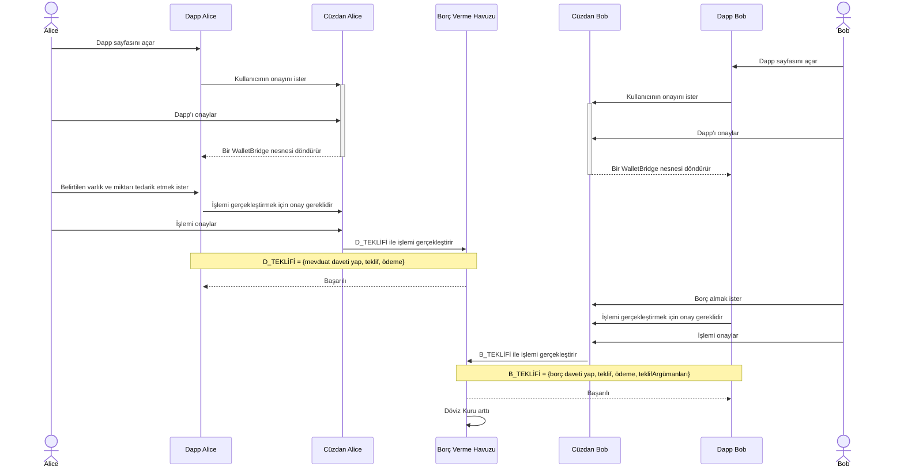

# Ders Yedi - Çok Kullanıcılı Dapps, Kredi Protokolü
## İçindekiler
* Çok Kullanıcılı Dapps
  * SwingSet ve Cosmos Katmanı
    * SwingSet (AgoricVM)
  * `cosmic-swingset` Paketi
    * Gereklilikler
    * `cosmic-swingset` ile birden fazla `ag-solo`
      * 1M IST ile bir `ag-solo` nasıl başlatılır?
  * Örnek: LendingPool'u 3 `ag-solo` ve bir node `local-chain` kullanarak nasıl sergileriz?
    * Dapp UI'nızın doğru `ag-solo`ya bağlandığından emin olun
* Havuz Temelli Kredi Protokolü
  * Kredi Havuzu Nedir?
  * Kredi Havuzu Nasıl Çalışır?
  * Örnek Kullanım Senaryosu

# Çok Kullanıcılı Dapps
Merkezsizleşme, **güvenmediğimiz kişilerle** iş yapmamızı sağlar. Bu nedenle, dapp'ler genellikle çok kullanıcılı bir şekilde tasarlanır ve kullanıcılar birbirleriyle et interact eder. Örneğin, varlıkları ticaret yapma, NFT'leri kiralamak vb. Bu, bir dapp geliştirici olarak, dapp'lerinizi birden fazla `ag-solo` kullanarak test etmeniz gerektiği anlamına gelir.

Agoric, simüle edilmiş bir zincir ve bir `ag-solo` ile hızlı testler yapmak için bir `sim-chain` özelliği sunar.
Bu güzel ve faydalıdır ancak birden fazla `ag-solo`nun paylaşılan bir blockchain ile çalışması gereken bir yapı için, `sim-chain` yetersiz kalır. Blockchain ve `ag-solo`nun yerel olarak ayrılması için bir yol gereklidir. Bunun için `cosmic-swingset` paketi vardır.
Ama önce, biraz bağlam.

## Bağlam: SwingSet ve Cosmos Katmanı

Aşağıdaki diagram, `Agoric Teknoloji Yığını`nı göstermektedir.


> _Şekil 1: Agoric Teknoloji Yığını, resim [Agoric Dökümanları](https://docs.agoric.com/guides/platform/)ndan alınmıştır_

Alt katmanda, Agoric ağı arasında uzlaşmayı sağlayan `Cosmos/Tendermint` vardır.
Onun üzerinde, `SwingSet` vardır:

### `SwingSet` Nedir?
`SwingSet`, `vat`lar arasındaki iletişimi yöneten bir çekirdektir. Ayrıca `AgoricVM` olarak da adlandırılır. Bir `SwingSet` çekirdeğindeki her `vat`, XS JavaScript Engine'in sertleştirilmiş bir versiyonudur. Aşağıda, bir `SwingSet`i görselleştiren bir diyagram bulunmaktadır:


> _Şekil 2: SwingSet Çekirdeği_

Yukarıdaki ekran görüntüsü [Agoric Swingset Kernel and Userspace, Phase 2](https://agoric.com/wp-content/uploads/2021/11/informal-agoric-report-phase2.pdf) 
güvenlik denetiminden alınmıştır. [Agoric Güvenlik](https://agoric.com/security/)deki diğer raporları kontrol etmeyi unutmayın.

## `cosmic-swingset` Paketi

[cosmic-swingset](https://github.com/Agoric/agoric-sdk/tree/65d3f14c8102993168d2568eed5e6acbcba0c48a/packages/cosmic-swingset)
gerçek bir cosmos düğümünde çalışan bir `Agoric VM` çalıştırmak için birçok faydalı özelliğe sahiptir.

### Gereklilikler
`Cosmos SDK` `Go Programlama Dili` kullanılarak oluşturulmuştur. Dolayısıyla, uzlaşma özelliklerine erişmek için, `SwingSet` ve uzlaşma katmanı arasında köprü kuracak yardımcılara ihtiyacımız var. Bu yardımcılar;
* `agd`
* `ag-cosmos-helper`

Bu yardımcıları kaynaktan inşa etmemiz gerekiyor;

> [Agoric Dökümanları - Çok Kullanıcılı Dapp'lerin Başlatılması - Kullanım - 3. ve 4. Adımlar](https://docs.agoric.com/guides/dapps/starting-multiuser-dapps.html#usage)ı kontrol edebilirsiniz, ancak yine de kolaylık olması için adımları buraya koyacağım.

```shell
cd agoric-sdk/packages/cosmic-swingset && make
```

Sonra;

```shell
# $PATH içerisinde olması gereken dizini gösterir.
echo ${GOBIN-${GOPATH-$HOME/go}/bin}
# Orada kurulu bir ikiliyi çalıştırmayı dener.
ag-cosmos-helper version --long
```

Burada önemli olan şey, `agd` ve `ag-cosmos-helper`'ın `$PATH` içerisinde olması gerekliliğidir.

Başarılı bir `make` işlemi için gereklilikleri
[cosmic-swingset/README.md](https://github.com/Agoric/agoric-sdk/tree/65d3f14c8102993168d2568eed5e6acbcba0c48a/packages/cosmic-swingset#build-from-source) 
adresinden kontrol edebilirsiniz.

### `cosmic-swingset` ile Birden Fazla `ag-solo`
`cosmic-swingset` paketi toplamda farklı konfigürasyonlar için 4 senaryo içerir;
* senaryo1
* senaryo2
* senaryo3
* senaryo0
  
# Ders Yedi - Çok Kullanıcılı Dapps, Kredi Protokolü
## İçindekiler
* Çok Kullanıcılı Dapps
  * SwingSet ve Cosmos Katmanı
    * SwingSet (AgoricVM)
  * `cosmic-swingset` Paketi
    * Ön Koşullar
    * `cosmic-swingset` ile Çoklu `ag-solos`
      * 1M IST ile bir `ag-solo` nasıl başlatılır?
  * Örnek: LendingPool'u 3 `ag-solo` ve bir `local-chain` düğümü kullanarak nasıl sergileriz?
    * Dapp UI'nızın doğru `ag-solo`'ya bağlandığından emin olun
* Havuz Temelli Kredi Protokolü
  * Bir Kredi Havuzu nedir?
  * Bir Kredi Havuzu nasıl çalışır?
  * Örnek Kullanım Durumu

# Çok Kullanıcılı Dapps
Merkeziyetsizlik, bize **güvenmediğimiz kişilerle** iş yapma olanağı sağlar. Dolayısıyla, çoğu dapp, kullanıcıların birbiriyle etkileşimde bulunduğu çok kullanıcılı bir şekilde tasarlanmıştır. Örneğin, varlık alışverişi, NFT kiralaması vb. Bu, bir dapp geliştirici olarak, dapp'lerinizi birden çok `ag-solo` kullanarak test etmeniz gerekebileceği anlamına gelir.

Agoric, bir simüle zinciri ve bir `ag-solo`'nun birlikte çalıştığı hızlı testler için bir `sim-chain` özelliği sunar. Bu güzel ve kullanışlıdır, ancak birden çok `ag-solo`'nun paylaşılan bir blockchain ile çalışması gereken bir yapı için `sim-chain` yetersiz kalır. Blockchain ve `ag-solo`'yu yerelde ayırmak için bir yola ihtiyacımız var. Bunun için `cosmic-swingset` paketi var. Ama önce, biraz bağlam.

## Bağlam: SwingSet ve Cosmos Katmanı

Aşağıda `Agoric Tech Stack`'in bir diyagramı gösterilmektedir


> _Şekil 1: Agoric Teknoloji Yığını, resim [Agoric Dokümantasyonu](https://docs.agoric.com/guides/platform/)ndan alınmıştır_

Alt katmanda `Cosmos/Tendermint` bulunmaktadır ve bu, Agoric ağı boyunca konsensüsü yönetir. Bunun üstünde `SwingSet` bulunur:

### `SwingSet` Nedir?
`SwingSet` bir çekirdektir ve `vat`lar arasındaki iletişimi yönetir. Aynı zamanda `AgoricVM` olarak da adlandırılır. Bir `SwingSet` çekirdeği içindeki her `vat`, XS JavaScript Motorunun sertleştirilmiş bir sürümüdür. Aşağıda bir `SwingSet`'i görselleştiren bir diyagram bulunmaktadır:


> _Şekil 2: SwingSet Çekirdeği_

Yukarıdaki ekran görüntüsü [Agoric Swingset Çekirdeği ve Kullanıcı Alanı, Faz 2](https://agoric.com/wp-content/uploads/2021/11/informal-agoric-report-phase2.pdf) güvenlik denetiminden alınmıştır. [Agoric Güvenlik](https://agoric.com/security/) bölümündeki diğer raporları kontrol etmeyi unutmayın.

## `cosmic-swingset` Paketi

[cosmic-swingset](https://github.com/Agoric/agoric-sdk/tree/65d3f14c8102993168d2568eed5e6acbcba0c48a/packages/cosmic-swingset) gerçek bir cosmos düğümünde çalışan bir `Agoric VM`'yi çalıştırmak için birçok kullanışlı özelliklere sahiptir.

### Ön Koşullar
`Cosmos SDK` `Go Programlama Dili` kullanılarak oluşturulmuştur. Bu nedenle, konsensüs özelliklerine erişmek için `SwingSet` ve konsensüs katmanı arasındaki köprüyü oluşturacak yardımcılara ihtiyacımız var. Bu yardımcılar şunlardır:
* `agd`
* `ag-cosmos-helper`

Bu yardımcıları kaynaktan oluşturmamız gerekiyor;

> [Agoric Dokümantasyonu - Çok Kullanıcılı Dapp'ler Başlatma - Kullanım - Adım 3 ve 4](https://docs.agoric.com/guides/dapps/starting-multiuser-dapps.html#usage)'ü kontrol edebilirsiniz, ama kolaylık olması açısından adımları buraya da ekleyeceğim.

```shell
cd agoric-sdk/packages/cosmic-swingset && make
```

Sonra;

```shell
# Yolunuzda olması gereken dizini görüntüler.
echo ${GOBIN-${GOPATH-$HOME/go}/bin}
# Orada kurulu olan bir ikiliyi çalıştırmaya çalışır.
ag-cosmos-helper version --long
```

Burada önemli olan şey, `agd` ve `ag-cosmos-helper`'ın `$PATH`'inizde olması gerektiğidir.

Başarılı bir `make` işlemi için [cosmic-swingset/README.md](https://github.com/Agoric/agoric-sdk/tree/65d3f14c8102993168d2568eed5e6acbcba0c48a/packages/cosmic-swingset#build-from-source) 'da belirtilen ön koşulları kontrol edin.

### `cosmic-swingset` ile Çoklu `ag-solos`
`cosmic-swingset` paketi, farklı konfigürasyonlar için toplam 4 senaryo içerir

Sadece `scenario2`, çoklu `ag-solo` kurulumu için yapılandırmayı destekler. Bu yüzden burada ona odaklanacağız. Daha fazla bilgi için 
[cosmic-swingset/README.md](https://github.com/Agoric/agoric-sdk/tree/65d3f14c8102993168d2568eed5e6acbcba0c48a/packages/cosmic-swingset)
ve 
[cosmic-swingset/Makefile](https://github.com/Agoric/agoric-sdk/blob/65d3f14c8102993168d2568eed5e6acbcba0c48a/packages/cosmic-swingset/Makefile)
adreslerine bakabilirsiniz.

`cosmic-swingset` paketi kullanarak çok kullanıcılı bir dapp başlatmak için önce ortamı ayarlamanız gerekir;

```shell
cd agoric-sdk/packages/cosmic-swingset
make scenario2-setup BASE_PORT=8000 NUM_SOLOS=3
```

* `NUM_SOLOS`: Oluşturmak istediğiniz `ag-solos` sayısı, varsayılan değer birdir.
* `BASE_PORT`: İlk `ag-solo` için port belirtir, diğer `ag-solos`'lar için bir arttırır. Yukarıdaki
konfigürasyonda kullanılan portlar: 8000, 8001, 8002.

Kurulum tamamlandığında, zinciri başlatabiliriz;

```shell
make scenario2-run-chain-economy
```

Zincir konfigürasyonu için birkaç seçenek vardır. Havuz Tabanlı Kredi Protokolü'nde, Agoric'in ekonomik hizmetlerle etkileşimde bulunmamız gerektiği için `scenario2-run-chain-economy` konfigürasyonunu kullanıyoruz. Eğer bu tür bir etkileşime ihtiyacınız yoksa, daha hızlı başlaması için basitçe `scenario2-run-chain` kullanabilirsiniz;

```shell
make scenario2-run-chain
```

Zinciri (yukarıdaki konfigürasyonlardan herhangi biri ile) başlattıktan sonra, artık `ag-solos`'ları başlatabiliriz;

```shell
cd agoric-sdk/packages/cosmic-swingset
make scenario2-run-client BASE_PORT=8000
```

İkinci `ag-solos`'u ve sonrakileri başlatırken ayarlanması gereken başka bir ortam değişkeni vardır. Bu, [Prometheus](https://prometheus.io/)
tarafından `ag-solos` ölçümlerini izlemek için bir port belirleyen `SOLO_OTEL_EXPORTER_PROMETHEUS_PORT`'tur. Bu yüzden, ikinci `ag-solo` için başlatma komutu şu şekildedir;

```shell
cd agoric-sdk/packages/cosmic-swingset
make scenario2-run-client BASE_PORT=8001 SOLO_OTEL_EXPORTER_PROMETHEUS_PORT=9466 # 9465 varsayılan değerdir
```

Yukarıdaki adımı, uygun ortam değişkenlerini değiştirerek istediğiniz kadar `ag-solos` için tekrar edebilirsiniz.

#### 1M IST ile bir `ag-solo` Nasıl Başlatılır?
Bazı çevresel bileşenlere bağlı olan bir dapp'ınız olduğunu hayal edin. Örneğin, `LendingPool`'un düzgün çalışması için bazı AMM Havuzlarının var olması gerekmektedir. Bu yüzden, `creator`'un bu havuzu AMM'ye eklemesi gerekiyor. Bu işlem çok fazla IST gerektirir ve `creator`, varsayılan _coin config_ ile başlatıldığında IST'lerini tüketebilir. Bunu önlemek için şu havalı hileyi kullanıyoruz:

```shell
cd agoric-sdk/packages/cosmic-swingset
make scenario2-run-client BASE_PORT=8000 SOLO_COINS='13000000ubld,1000000000000uist,1122000000ibc/usdc1234,3344000000ibc/atom1234'
```

`creator`'ın port 8000'de çalıştığını hayal edin, `SOLO_COINS` ortam değişkeni _coin config_'i bir dize olarak içerir. Makefile'da bir varsayılan değer ayarlanmıştır, ancak yukarıdaki komutta gösterildiği gibi bu değeri değiştirmek mümkündür.
`uist` sayısına dikkat edin, IST için ondalık basamak sayısı `6`'dır yani `1M * 10 ** 6` IST birimi ilgili `ag-solos` cüzdanına önyüklenir. Bu, `scenario2` ile testleriniz için düşünebileceğiniz kullanışlı bir hiledir.

## Örnek: LendingPool'u 3 `ag-solos` ve bir `local-chain` düğümü kullanarak nasıl sergileriz?
LendingPool'da, 3 `ag-solos` ve bir yerel blockchain olan bir ağ konfigürasyonu kullanırız. Bu `ag-solos`'lar;
* Creator
* Alice
* Bob

`creator`'ın sergileme senaryosu için g

erekli bazı şeyleri önyüklemesi gerektiğini hatırlayın. Aşağıda basit bir diyagram bulunmaktadır;


Yukarıda bu ortamı ayarlamak için kullandığımız birçok komut hakkında konuştuk, bu yüzden hepsini burada bir araya getireceğim;

Birinci Terminal:

```shell
cd agoric-sdk/packages/cosmic-swingset
make scenario2-setup BASE_PORT=8000 NUM_SOLOS=3 && make scenario2-run-chain-economy
```

İkinci Terminal, Creator:

```shell
cd agoric-sdk/packages/cosmic-swingset
make scenario2-run-client BASE_PORT=8000 SOLO_COINS='13000000ubld,1000000000000uist,1122000000ibc/usdc1234,3344000000ibc/atom1234'
```
Üçüncü Terminal, Alice:

```shell
cd agoric-sdk/packages/cosmic-swingset
make scenario2-run-client BASE_PORT=8001 SOLO_OTEL_EXPORTER_PROMETHEUS_PORT=9466
```

Dördüncü Terminal, Bob:

```shell
cd agoric-sdk/packages/cosmic-swingset
make scenario2-run-client BASE_PORT=8002 SOLO_OTEL_EXPORTER_PROMETHEUS_PORT=9467
```

Beşinci Terminal:

```shell
cd agoric-sdk/packages/cosmic-swingset/t1
agoric open --no-browser --repl
agoric open --no-browser --hostport=127.0.0.1:8001 --repl
agoric open --no-browser --hostport=127.0.0.1:8002 --repl
```

`t1` dizini, anahtarlar ve adresler gibi kullanıcı bilgilerinin saklandığı yerdir. `--hostport` bayrağı, bu komutun çalıştırıldığında bağlanacağı `ag-solo`nun adresini belirtir. Bu yüzden ikinci `agoric open` Alice'in cüzdanını açar ve üçüncüsü Bob'un cüzdanını açar.

### Dapp UI'nızın doğru `ag-solo`ya bağlandığından emin olun
Yukarıdaki adımların hepsini tamamladığınızı, LendingPool sözleşmelerini yerleştirdiğinizi ve dapp UI'ı başlattığınızı varsayalım. Dapp UI'nın Agoric ağı ile etkileşim kurmak için bir `walletBridge` nesnesine ihtiyacı vardır. `WalletBridge` yalnızca bir kullanıcı onayıyla gönderilebildiğinden, dapp UI temsil edeceği `ag-solo`ya bağlanmalıdır. Bu durum, `ag-solo`ya bir webSocket açarak ele alınır. Çalıştırdığımız yapılandırmayı, 3 `ag-solo` olduğunu hatırlayın, değil mi? Alice ve Bob kendi dapp UI'larına sahip olacaklar, peki bu dapp UI'ların doğru `ag-solo`ya nasıl bağlandığından emin olacağız? Agoric, bunun için `local.agoric.com` adlı bir hizmet sunuyor. Aşağıdaki diyagram akışı gösterir;


Dedik ki, dapp UI'nın bir WebSocket açmak için bir adrese ihtiyacı var, bunu nasıl elde ettiği `local.agoric.com`a sorarak olur. Adım numarası `0`'da, dapp geliştiricisi `ag-solo`nun adresini girer ve `local.agoric.com` bu bilgileri tarayıcı depolamasında, _çerezler_ gibi tutar. Bu yüzden, farklı dapp UI'ların farklı `ag-solos`'lara bağlanabilmesi için, `ag-solo`ya bağlanmaya çalıştığımız tarayıcı için ayrı bir depolama alanına ihtiyacımız var. Bunun için seçenekler olabilir;
* Alice ve Bob için farklı tarayıcılar kullanmak, Firefox ve Chrome gibi
* Chrome kullanıyorsanız, Alice ve Bob için farklı profiller oluşturmak

LendingPool UI'si şu anda Chrome ile en uyumlu olduğu için, ikinci seçeneği tercih ediyoruz. Bu şöyle görünüyor:


Yukarıdaki diyagramda, kırmızı profil Alice'i temsil ederken yeşil profil Bob'u temsil ediyor. Alice'in dapp UI'si kırmızı profilde açılmalı, Bob'un dapp UI'si yeşil olanıda açılmalıdır.

# Havuz Tabanlı Borç Verme Protokolü
## Bir Borç Verme Havuzu Nedir?
Borç Verme Havuzu, [Compound Finance](https://compound.finance/) ve [AAVE](https://aave.com/) gibi pek çok canlı örneği olan bir DeFi kavramıdır. Temel fikir, LP'lerin (Likidite Sağlayıcıları) çeşitli getiriler aradığı bir likidite havuzu olmasıdır. Çoğu zaman, bu borç verme havuzlarının kendi yönetim tokenları da vardır ve bunları da LP'lerine dağıtırlar. Ana faydalardan biri, borç verme havuzlarının şu anda likiditeye kimin erişeceği ve kimin erişemeyeceği konusunda bankaların yaptığı aynı `GateKeeping` işlemi yapmamasıdır.

## Bir Borç Verme Havuzu Nasıl Çalışır?
Fikir harika, ama bu nasıl çalışacak? `Havuz Tabanlı Borç Verme Protokolümüz`, en büyük merkezi olmayan borç verme protokollerinden biri olan, belki de en büyük olan [Compound Finance](https://compound.finance/)'dan esinlendi. Bu yüzden protokolü açıklamak için Compound'un bazı mantığını kullanacağım. Compound Finance'ın nasıl çalıştığını [BytePitch'teki blog yazımızda](https://bytepitch.com/blog/pool-based-lending-protocol-agoric/) anlatıyoruz. 

Daha fazla öğrenmek isterseniz kontrol etmeyi unutmayın.

Bir merkezi olmayan borç verme protokolünün ana özelliklerinden biri **Aşırı teminatlandırma**dır. Blog yazımızdan aşırı teminatlandırma hakkında bir örnek:

"_Kelimenin 'aşırı' anlamı, teminatın değerinin borcun değerinden daha yüksek olması gerektiğidir._ 
_Mesela, teminat olarak kullanmak üzere 100 dolarınız var ve teminatlandırma faktörü %80 ise en fazla_
_80 dolar borç alabilirsiniz. Ana fikir, borç vereni, borçlunun borcunu ödemezse bile, borç verenin para kaybetmemesini sağlamaktır._"

`Havuz Tabanlı Borç Verme Protokolü` üç formüle bağlıdır. Daha fazlasını öğrenmek için [Compound Whitepaper](https://compound.finance/documents/Compound.Whitepaper.pdf)'ı kontrol edin.

1. **Kullanım Oranı:** Protokoldaki toplam borç ile protokolün toplam arzı arasındaki oran.

   

2. **Borç Faizi:** Borcun güncel faiz oranı.

   

3. **Döviz Kuru:** Borç verme protokolündeki her havuz, havuza özel bir sarıcı token verir. Compound için bunlara `cToken` ve protokolümüz için `AgToken` denir. `Döviz Kuru`, gerçek token ile sarıcı token arasındaki orandır. Aşağıda formülü bulunmaktadır.
  
   

İşte, havuzdaki likiditenin faiz oranını nasıl etkilediği hakkında blog yazımızdan bir örnek:

"_Örneğin, bir havuzda 1000 dolarlık bir alt varlık olduğunu ve ayrıca 100 dolarlık toplam borcun da olduğunu varsayalım._
_Piyasanın bu noktasında, kredilere uygulanan yıllık faiz oranının %x olduğunu da varsayalım._ 
_Eğer biri şimdi 50 dolar daha borç alırsa, mevcut piyasa durumu şuna dönüşür; 950 dolarlık alt varlık likiditesi ve 150 dolarlık_
_toplam borç. Bu yüzden, dinamik faiz oranı uğruna, yeni yıllık faiz oranı şimdi %y ve biz eminiz ki_
_y > x çünkü artık alt varlık likiditesi eskisinden daha az, yani paranın fiyatı, faiz oranı,_
_artık artmıştır._"

## Örnek Kullanım Senaryosu
Aşağıda, `döviz kurunun` arttıkça tedarikçi Alice'in nasıl para kazandığını gösteren basit bir kullanım durumu bulunmaktadır:


