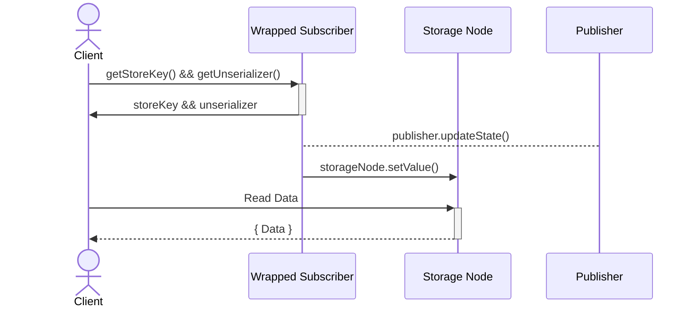

# Ders Altı - Bildirimciler ve Abonelikler

## İçindekiler

- Bildirimci paketi
- Değer türlerinin farklı taşıyıcıları
- Bir asenkron iterasyonu tüketmek için farklı araçlar
  - For-await-of döngüsü
  - ObserveIteration uyarlayıcısı
  - ObserveIterator uyarlayıcısı
- Örneklerin Test Edilmesi
  - Başarı örneği
  - Promise örneği
  - Yerel temsil örneği
  - Genel temsil örneği
  - AbonelikIterator örneği
- makeSubscriptionKit vs makePublishKit
- makeNotifierKit vs makeSubscriptionKit
- Kullanıcı Arayüzü (UI)
- Abone Verilerinin Saklanması
  - Vat zincir depolamasına girin

## Bildirimci Paketi

[notifier paketi](https://github.com/Agoric/agoric-sdk/tree/65d3f14c8102993168d2568eed5e6acbcba0c48a/packages/notifier), "bir hizmetin durum değişikliklerini istemcilere bildirmesine izin verir. Özellikle, asenkron değer dizilerinin üretilmesi ve tüketilmesi için soyutlamalardır. Bildirimci veya abonelik, ilgilenen istemcilere güncellemeleri yayınlamak isteyen bir nesne tarafından kullanılabilir hale getirilir." - [Bildirimciler ve Abonelikler](https://docs.agoric.com/guides/js-programming/notifiers.html)

## Değerlerin Farklı Taşıyıcı Türleri

- **Değerlerin kayıpsız taşıyıcısı**, asenkron bir iterasyondaki tüm değerlerin doğru ve eksiksiz bir şekilde iletilmesini sağlayan bir mekanizmayı ifade eder. "Kayıpsız" terimi, iletim süreci sırasında hiçbir bilginin kaybolmadığını ve değerlerin tamamının aktarıldığını gösterir. Bu, tüm yayınlanan durumun, son olmayan değerlerin yanı sıra son değerin her zaman kullanılabilir olacağı anlamına gelir.

- **Değerlerin kayıplı taşıyıcısı**, asenkron bir iterasyonda değerleri ileten bir mekanizmayı ifade eder, burada bazı değerler doğru şekilde iletilmeyebilir. "Kayıplı" terimi, iletim süreci sırasında bazı bilgilerin kaybolabileceğini veya atılabileceğini gösterir. Ancak, iterasyonun sonlanması veya son değeri yine de kayıpsız iletilir, böylece alıcı iterasyonun tamamlandığını bilir. Bu, daha yeni bir yayınlanan durum varsa, önceki yayınlanan durumu kaçırabileceğiniz anlamına gelir.

- **Önek-kayıplı taşıyıcı**, yayıncının tamamen kayıpsız olabilmesi için yayıncının hızlı tüketimini gerektirir. "Önek-kayıplı" terimi, tüketici bir yineleyici isteği yapmadan önce yayıncı tarafından yayınlanan değerlerin kaybedilebileceği anlamına gelir, ancak bir yineleyici elde edildiğinde, o yineleyici tarafından numaralandırılan değerler tam ve doğru olacaktır. Bu, döndürülen yineleyiciden önce yayınlanan her şeyi kaçırabileceğiniz anlamına gelir. Ancak, döndürülen yineleyici, o yineleyicinin başlangıç noktasından itibaren yayınlanan her şeyi numaralandıracaktır.

[SubscriptionKit](https://github.com/Agoric/agoric-sdk/blob/65d3f14c8102993168d2568eed5e6acbcba0c48a/packages/notifier/src/subscriber.js), değerlerin kayıpsız taşıyıcısıdır; <br>
[NotifierKit](https://github.com/Agoric/agoric-sdk/blob/65d3f14c8102993168d2568eed5e6acbcba0c48a/packages/notifier/src/notifier.js), değerlerin kayıplı taşıyıcısıdır; <br>
[PublishKit](https://github.com/Agoric/agoric-sdk/blob/65d3f14c8102993168d2568eed5e6acbcba0c48a/packages/notifier/src/publish-kit.js), değerlerin önek-kayıplı taşıyıcısıdır; <br>

## Asenkron bir iterasyonu tüketmek için farklı araçlar

[notifier paketi belgeleri](https://github.com/Agoric/agoric-sdk/blob/65d3f14c8102993168d2568eed5e6acbcba0c48a/packages/notifier/README.md), bir asenkron iterasyonu tüketmek için aşağıdaki iki farklı yaklaşımı kullanmayı önerir:

- JavaScript `for-await-of` sözdizimi
- `observeIteration` uyarlayıcısı
- `observeIterator` uyarlayıcısı

Onların arasındaki farkı daha iyi anlamak için, [kaynak kodlarını](https://github.com/Agoric/agoric-sdk/blob/65d3f14c8102993168d2568eed5e6acbcba0c48a/packages/notifier/test/iterable-testing-tools.js) analiz edeceğiz.
Ancak önce, bir asenkron iterasyonu, yani `yayıncıyı`, içereceğiz.

```js
/**
 * See the Paula example in the README
 *
 * @param {IterationObserver<Passable>} iterationObserver
 * @returns {void}
 */
export const paula = (iterationObserver) => {
  // Paula the publisher says
  iterationObserver.updateState("a");
  iterationObserver.updateState("b");
  iterationObserver.finish("done");
};
```

`iterationObserver` nesnesi, `makeNotifierKit()` veya `makeSubscriptionKit()` kullanılarak oluşturulur ve bunlar sırasıyla bir `updater` veya `publication` döndürür.

```js
type IterationObserver<T> = {
  updateState: (nonFinalValue: T) => void,
  finish: (completion: T) => void,
  fail: (reason: any) => void,
};
```

### For-await-of döngüsü

İterasyonu `for-await-of` döngüsü kullanarak tüketin:

- final olmayan değerleri ve iterasyonun tamamlanıp tamamlanmadığını veya başarısız olup olmadığını görebilir.
- başarısızlık sebebini görebilir,
- tamamlanma değerini göremez

```js
/**
 * README'deki Alice örneğine bakın
 *
 * @param {AsyncIterable<Passable>} asyncIterable
 * @returns {Promise<Passable[]>}
 */
export const alice = async (asyncIterable) => {
  const log = [];

  try {
    for await (const val of asyncIterable) {
      log.push(["non-final", val]);
    }
    log.push(["finished"]);
  } catch (reason) {
    log.push(["failed", reason]);
  }
  return log;
};
```

Tamamlanma değerinin log dizisine eklenmediğini, yalnızca `finished` durumunun eklendiğini göz önünde bulundurun.
Yukarıdaki işlevden dönen log'u yazdırırsak ve Paula'nın yayıncısını iterasyon olarak kabul edersek, sonuç şu şekilde olur:

```js
// sonunda yazdırır
// non-final a
// non-final b
// the iteration finished
```

### ObserveIteration adaptörü

İterasyonu `observeIteration(asyncIterableP, iterationObserver)` adaptörü kullanarak tüketin:

- final olmayan değerleri ve iterasyonun tamamlanıp tamamlanmadığını veya başarısız olup olmadığını görebilir.
- başarısızlık sebebini görebilir,
- tamamlanma değerini görebilir

```js
/**
 * README'deki Bob örneğine bakın
 *
 * @param {ERef<AsyncIterable<Passable>>} asyncIterableP
 * @returns {Promise<Passable[]>}
 */
export const bob = async (asyncIterableP) => {
  const log = [];
  const observer = harden({
    updateState: (val) => log.push(["non-final", val]),
    finish: (completion) => log.push(["finished", completion]),
    fail: (reason) => log.push(["failed", reason]),
  });
  await observeIteration(asyncIterableP, observer);
  return log;
};
```

Bu metodu kullanırken tamamlanma değerinin (`completion`) log dizisine eklendiğini görebiliriz.
Yukarıdaki işlevden dönen log'u yazdırırsak ve Paula'nın yayıncısını iterasyon olarak kabul edersek, sonuç şu şekilde olur:

```js
// sonunda yazdırır
// non-final a
// non-final b
// finished done
```

### ObserveIterator adaptörü

Bir asenkron iterasyonu tüketmek için `observeIteration` ve `observeIterator` kullanmanın arasındaki fark, iterasyonla etkileşim kurmak için kullanılan soyutlama seviyesine atıfta bulunur. ObserveIterator'ın, `carol()`, sadece `subscriptions` için geçerli olduğunu hatırlamak önemlidir.

ObserveIteration, argüman olarak bir `AsyncIterable` alır, bu daha yüksek düzeyde bir soyutlama olup iterasyonu tüketmek için daha uygun bir arayüz sağlar. Bu yaklaşım genellikle kullanması daha kolay ve daha rahattır ancak temel iterasyon süreci üzerinde daha fazla kontrol sağlamayabilir.

Diğer taraftan, observeIterator, argüman olarak bir `AsyncIterator` alır, bu daha düşük düzeyde bir soyutlama olup temel yineleyiciye doğrudan erişim sağlar. Bu yaklaşım, iterasyon süreci üzerinde daha fazla kontrol sağlar, ancak iterasyonu yönetmek için daha karmaşık kod gerektirebilir ve kullanması daha az rahat olabilir.

Carol'ün observeIterator'ı doğrudan kullanma yaklaşımı genellikle özel asenkron veri yapılarını uygularken veya karmaşık veya son derece optimize edilmiş iterasyon süreçleriyle uğraşırken, iterasyon süreci üzerinde daha fazla kontrol gerektiren durumlarda kullanılır.

```js
/**
 * See the Carol example in the README. The Alice and Bob code above have
 * been abstracted from the code in the README to apply to any IterationObserver
 * and AsyncIterable. By contrast, the Carol code is inherently specific to
 * subscriptions.
 *
 * @param {ERef<Subscription<Passable>>} subscriptionP
 * @returns {Promise<Passable[]>}
 */
export const carol = async (subscriptionP) => {
  const subscriptionIteratorP = E(subscriptionP)[Symbol.asyncIterator]();
  const { promise: afterA, resolve: afterAResolve } = makePromiseKit();

  const makeObserver = (log) =>
    harden({
      updateState: (val) => {
        if (val === "a") {
          // @ts-expect-error
          afterAResolve(E(subscriptionIteratorP).subscribe());
        }
        log.push(["non-final", val]);
      },
      finish: (completion) => log.push(["finished", completion]),
      fail: (reason) => log.push(["failed", reason]),
    });

  const log1 = [];
  const observer1 = makeObserver(log1);
  const log2 = [];
  const observer2 = makeObserver(log2);

  const p1 = observeIterator(subscriptionIteratorP, observer1);
  // afterA is an ERef<Subscription> so we use observeIteration on it.
  const p2 = observeIteration(afterA, observer2);
  await Promise.all([p1, p2]);
  return [log1, log2];
};
```

Paula'nın yayıncısını yinelediğimizi varsayarak, yukarıdaki işlevde döndürülen günlüğü yazdırırsak, sonuç şöyle olur:

```js
[log1:
// eventually prints
// non-final a
// non-final b
// finished done
,
log2:
// eventually prints
// non-final b
// finished done
];
```

## Test Örnekleri

Aşağıdaki örnekler, daha önce incelenen kodun etkinliğini ve işlevselliğini sergiler çünkü belirli yöntemleri içe aktarır ve kullanır.

```js
import { paula, alice, bob, carol } from "./iterable-testing-tools.js";
```

Bu [testler](https://github.com/Agoric/agoric-sdk/blob/65d3f14c8102993168d2568eed5e6acbcba0c48a/packages/notifier/test/test-subscriber-examples.js), `makeSubscriptionKit()` kullanılarak yapılacaktır, ancak aynı mantık `makeNotifierKit()` kullanıldığında da geçerlidir. Bu [makenotifierkit-vs-makesubscriptionkit](#makenotifierkit-vs-makesubscriptionkit) alt bölümde açıklanmıştır.

### Başarılı örnek

İlk test, bir interation'ı tüketme iki yolun davranışını gösterir; `alice()` içinde uygulanan `for-await-of` sözdizimi ve `bob()` içinde uygulanan `observeIteration` adaptörü:

```js
test("subscription for-await-of success example", async (t) => {
  const { publication, subscription } = makeSubscriptionKit();
  paula(publication);
  const log = await alice(subscription);

  t.deepEqual(log, [["non-final", "a"], ["non-final", "b"], ["finished"]]);
});

test("subscription observeIteration success example", async (t) => {
  const { publication, subscription } = makeSubscriptionKit();
  paula(publication);
  const log = await bob(subscription);

  t.deepEqual(log, [
    ["non-final", "a"],
    ["non-final", "b"],
    ["finished", "done"],
  ]);
});
```

Daha önce belirtildiği gibi, for-await-of yaklaşımı kullanıldığında, `finished` durumunun değeri döndürülmez, observeIteration ise `done` değerini döndürür.

### Promise örneği

Bu testte, alice ve bob'a `subscription`, yani bir `AsyncIterable` nesnesi yerine bir `promise` geçiriyoruz.
Dikkat edin ki, alice bir parametre olarak `{AsyncIterable<Passable>} asyncIterable` alırken, bob `{ERef<AsyncIterable<Passable>>} asyncIterableP` alır.
Bu, Promise üzerinden yinelemeye çalışırken alice'in kodunun hata vereceği, bob'un ise başarılı olacağı anlamına gelir.

```js
test("subscription for-await-of cannot eat promise", async (t) => {
  const { publication, subscription } = makeSubscriptionKit();
  paula(publication);
  const subP = Promise.resolve(subscription);
  // Type cast because this test demonstrates the failure that results from
  // giving Alice a promise for a subscription.
  const log = await alice(/** @type {any} */ (subP));

  // This TypeError is thrown by JavaScript when a for-await-in loop
  // attempts to iterate a promise that is not an async iterable.
  t.is(log[0][0], "failed");
  t.assert(log[0][1] instanceof TypeError);
});

test("subscription observeIteration can eat promise", async (t) => {
  const { publication, subscription } = makeSubscriptionKit();
  paula(publication);
  const subP = Promise.resolve(subscription);
  const log = await bob(subP);

  t.deepEqual(log, [
    ["non-final", "a"],
    ["non-final", "b"],
    ["finished", "done"],
  ]);
});
```

### Yerel temsilci örneği

Bu test için, aşağıdaki kod parçasının amacını anlamamız gerekiyor:

```js
const localSub = makeSubscription(E(subP).getSharableSubscriptionInternals());
```

Bu yöntem, bir Notifier/Subscription'ı ağı üzerinde etkili bir şekilde dağıtmak için kullanılır. Bunun için kopyalanacak Abonelikten bunu alır ve yeni siteye `makeSubscription`'ı uygular, bu da o siteye eşdeğer bir yerel Notifier getirir.

```js
test("subscription for-await-of on local representative", async (t) => {
  const { publication, subscription } = makeSubscriptionKit();
  paula(publication);
  const subP = Promise.resolve(subscription);
  const localSub = makeSubscription(E(subP).getSharableSubscriptionInternals());
  const log = await alice(localSub);

  t.deepEqual(log, [["non-final", "a"], ["non-final", "b"], ["finished"]]);
});

test("subscription observeIteration on local representative", async (t) => {
  const { publication, subscription } = makeSubscriptionKit();
  paula(publication);
  const subP = Promise.resolve(subscription);
  const localSub = makeSubscription(E(subP).getSharableSubscriptionInternals());
  const log = await bob(localSub);

  t.deepEqual(log, [
    ["non-final", "a"],
    ["non-final", "b"],
    ["finished", "done"],
  ]);
});
```

Alice ve Bob tarafından döndürülen sonuçlar, ilk testle aynı davranışı gösterecektir çünkü parametre olarak Promise `subP` yerine aboneliği karşılayan bir AsyncIterable nesnesi alır. Bu, önceki testte alice() tarafından döndürülen hatayı çözer.

Bir bildirici promise nesnesini AsyncIterable'a çevirmenin başka bir yolu, [makeAsyncIterableFromNotifier()](https://github.com/Agoric/agoric-sdk/blob/65d3f14c8102993168d2568eed5e6acbcba0c48a/packages/notifier/src/asyncIterableAdaptor.js#L37) metodunu kullanmaktır.

### Genel temsil örneği

Bu test için, `observeIteration()`'ın amacını anlamamız gerekiyor.
Aşağıdaki testlerden görebileceğimiz gibi, bu fonksiyon bir abonelik promise nesnesini ve yeni oluşturulan notifierKit()'in güncelleyicisi olacak bir iterationObserver parametre olarak alır.
`observeIteration()`'ın amacı, abonelik Promise üzerinde çağrılan farklı metodları filtrelemektir.

```js
/**
 * This reads from `asyncIterableP` updating `iterationObserver` with each
 * successive value. The `iterationObserver` may only be interested in certain
 * occurrences (`updateState`, `finish`, `fail`), so for convenience,
 * `observeIteration` feature tests for those methods before calling them.
 *
 * @template T
 * @param {ERef<AsyncIterable<T>>} asyncIterableP
 * @param {Partial<IterationObserver<T>>} iterationObserver
 * @returns {Promise<undefined>}
 */
export const observeIteration = (asyncIterableP, iterationObserver) => {
  const iteratorP = E(asyncIterableP)[Symbol.asyncIterator]();
  return observeIterator(iteratorP, iterationObserver);
};
```

```js
test("subscription for-await-of on generic representative", async (t) => {
  const { publication, subscription } = makeSubscriptionKit();
  paula(publication);
  const subP = Promise.resolve(subscription);
  const { publication: p, subscription: localSub } = makeSubscriptionKit();
  await observeIteration(subP, p);
  const log = await alice(localSub);

  t.deepEqual(log, [["non-final", "a"], ["non-final", "b"], ["finished"]]);
});

test("subscription observeIteration on generic representative", async (t) => {
  const { publication, subscription } = makeSubscriptionKit();
  paula(publication);
  const subP = Promise.resolve(subscription);
  const { publication: p, subscription: localSub } = makeSubscriptionKit();
  await observeIteration(subP, p);
  const log = await bob(localSub);

  t.deepEqual(log, [
    ["non-final", "a"],
    ["non-final", "b"],
    ["finished", "done"],
  ]);
});
```

Alice ve Bob tarafından döndürülen sonuçlar, aboneliği temsil eden AsyncIterable bir nesneyi argüman olarak aldığı için ilk testle aynı davranışı gösterecektir.

### SubscriptionIterator örneği

Bu test, AsyncIterable abonelik nesnesini argüman olarak geçirerek [ObserveIterator adaptör](#observeiterator-adaptor) alt bölümünde tanımlanan observeIterator metodunu uygular.

```js
// /////////////////////////////////////////////////////////////////////////////
// Carol is specific to subscription, so there is nothing analogous to the
// following in test-notifier-examples

test("subscribe to subscriptionIterator success example", async (t) => {
  const { publication, subscription } = makeSubscriptionKit();
  paula(publication);
  const log = await carol(subscription);

  t.deepEqual(log, [
    [
      ["non-final", "a"],
      ["non-final", "b"],
      ["finished", "done"],
    ],
    [
      ["non-final", "b"],
      ["finished", "done"],
    ],
  ]);
});
```

## makeSubscriptionKit vs makePublishKit

`agoric-sdk`yı keşfederken `publishKit` adlı bir şeyi fark edebiliriz, ancak bunun herhangi bir akıllı sözleşmede kullanılmadığını görürüz. Bu küçük bir detay gibi görünebilir ancak yine de kafa karıştırabilir. Bu yüzden kısaca bundan bahsedeceğiz.

`makeSubscriptionKit`'in uygulamasına bir göz atalım:

```js
const makeSubscriptionKit = () => {
  const { publisher, subscriber } = makePublishKit();

  // The publish kit subscriber is prefix-lossy, so making *this* subscriber completely
  // lossless requires eager consumption of the former.
  // Such losslessness inhibits GC, which is why we're moving away from it.
  const pubList = subscriber.subscribeAfter();
  const subscription = makeSubscription(pubList);

  /** @type {IterationObserver<T>} */
  const publication = Far("publication", {
    updateState: publisher.publish,
    finish: publisher.finish,
    fail: publisher.fail,
  });

  return harden({ publication, subscription });
};
```

Gördüğünüz gibi, metodun ilk satırında `makePublishKit` `publisher` ve `base subscriber` oluşturur. `base subscriber` terimini kullanıyoruz çünkü aşağıdaki satırlarda, publishKit'ten alınan bu abone, değerlerinin üzerinden yinelemeli olarak tüketilmesine ve publishKit'in `prefix lossy` doğasını tamamlamasına izin veren bazı metotlarla sarılır.

```js
const pubList = subscriber.subscribeAfter();
const subscription = makeSubscription(pubList);
```

## makeNotifierKit vs makeSubscriptionKit

`makeNotifierKit` testleri, dönen değerler dışında `makeSubscriptionKit` ile aynı davranışı gösterecektir. Daha önce açıkladığımız gibi, makeNotifierKit'i kullanırken, onun kayıp değerlere karşı hassas doğası, yalnızca son güncellenen değeri döndürmesine neden olacaktır.

makeSubscriptionKit'in ilk testini örnek olarak kullanarak, işte makeNotifierKit'i kullanarak yapılan karşılık gelen test.

```js
test("notifier for-await-of success example", async (t) => {
  const { updater, notifier } = makeNotifierKit();
  paula(updater);
  const log = await alice(notifier);

  t.deepEqual(last(log), ["finished"]);
});

test("notifier observeIteration success example", async (t) => {
  const { updater, notifier } = makeNotifierKit();
  paula(updater);
  const log = await bob(notifier);

  t.deepEqual(last(log), ["finished", "done"]);
});
```

Görebileceğimiz gibi, dönen log `['non-final', 'a'] ['non-final', 'b']` olmayan final değerlerini içermiyor.

## Kullanıcı Arayüzü (UI)

Notifier paketi, blockchain'den verileri çıkararak `kullanıcı arayüzünde` sunmak için son derece faydalıdır.
Aşağıdaki kodu inceleyelim, [dapp-card-store UI](https://github.com/Agoric/dapp-card-store/blob/main/ui/src/App.js)'dan.

```js
import { makeAsyncIterableFromNotifier as iterateNotifier } from '@agoric/notifier';

function App() {

  ...
      ...

      publicFacetRef.current = publicFacet;

      const availableItemsNotifier = E(
        publicFacetRef.current,
      ).getAvailableItemsNotifier();

      for await (const cardsAvailableAmount of iterateNotifier(
        availableItemsNotifier,
      )) {
        setAvailableCards(cardsAvailableAmount.value);
      }
    };

  ...
}
export default App;

```

`makeAsyncIterableFromNotifier()` metodu, [Local representative example](#local-representative-example) alt bölümünde açıklandığı gibi yerel bir bildirimci nesnesi oluşturur. Bu örnekte, geliştirici sözleşmenin kamuya açık yüzeyinden `availableItemsNotifier`'ı alır, makeAsyncIterableFromNotifier kullanarak yerel bildirimci `cardsAvailableAmount`'ı oluşturur ve bu bilgiyi grafiksel arayüzde göstermek için setAvailableCards'a argüman olarak geçer.

`Not: agoric organization repo'sunda getSharableSubscriptionInternals() kullanılan UI örnekleri bulunamadı`

## Abone Verilerini Saklama

Agoric'ten veri okumak ücretsiz mi? Maalesef, şu anki yapıya göre, bu sorunun yanıtı hayır.
Agoric'te, blockchain'den güncellemeler almanın ana yolu `Notifier` ve `Subscriber` kullanmaktır.

Bir notifier için,

```js
E(notifier).getUpdateSince();
```

Bir abone için,

```js
subscriberIterator = subscriber[Symbol.asyncIterator]();
E(subscriberIterator).next();
```

Her iki işlem de blockchain'de yaşayan nesnelerin yöntemlerini çağırdığı için, bu işlemler gaz ücreti gerektirir. Agoric ekibi, ekosistemdeki büyük ölçekli uygulamaları barındırmak için bu soruna bir çözüm bulmaları gerektiğini fark etti.

### İşte vat-chainStorage

Buna çözüm olarak, Agoric ekibi, anahtar-değer mağazası olarak hizmet verecek ayrı bir `static vat` tasarladı.
Yazma erişimi, yalnızca `inter-protocol` gibi uygun yeteneklere sahip diğer sistem düzeyi bileşenlerle sınırlıdır.
Öte yandan, okuma erişimi herkese açıktır. Bir `storageNode`'un anahtarını bilen herkes verileri ücretsiz olarak okuyabilir.
Bu tür bir `vat`ın tüm üçüncü taraf dapp geliştiricilere kullanılabilir hale getirilmesi için devam eden bir çaba var.

> Bir `static-vat`ın, bootstrap sırasında başlatılan ve bir sistem bileşenini barındıran bir vat türü olduğunu hatırlayın.

Aşağıdaki diyagram, normal bir `{ publisher, subscriber }` çiftinin nasıl kullanılacağını göstermektedir.
`vat-chainStorage` kullanımını yapmak için.



Aboneleri sarmak için uygulanan mekanizmalar vardır.
Bu mekanizmaları [storesub.js](https://github.com/Agoric/agoric-sdk/blob/65d3f14c8102993168d2568eed5e6acbcba0c48a/packages/notifier/src/storesub.js) adresinde kontrol edebilirsiniz.
