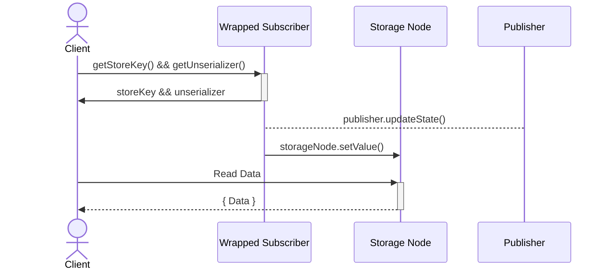

# Ders Altı - Bildirimciler ve Abonelikler

## İçindekiler

- Bildirimci paketi
- Değer türlerinin farklı taşıyıcıları
- Bir asenkron iterasyonu tüketmek için farklı araçlar
  - For-await-of döngüsü
  - ObserveIteration uyarlayıcısı
  - ObserveIterator uyarlayıcısı
- Örneklerin Test Edilmesi
  - Başarı örneği
  - Promise örneği
  - Yerel temsil örneği
  - Genel temsil örneği
  - AbonelikIterator örneği
- makeSubscriptionKit vs makePublishKit
- makeNotifierKit vs makeSubscriptionKit
- Kullanıcı Arayüzü (UI)
- Abone Verilerinin Saklanması
  - Vat zincir depolamasına girin

## Bildirimci Paketi

[notifier paketi](https://github.com/Agoric/agoric-sdk/tree/65d3f14c8102993168d2568eed5e6acbcba0c48a/packages/notifier), "bir hizmetin durum değişikliklerini istemcilere bildirmesine izin verir. Özellikle, asenkron değer dizilerinin üretilmesi ve tüketilmesi için soyutlamalardır. Bildirimci veya abonelik, ilgilenen istemcilere güncellemeleri yayınlamak isteyen bir nesne tarafından kullanılabilir hale getirilir." - [Bildirimciler ve Abonelikler](https://docs.agoric.com/guides/js-programming/notifiers.html)

## Değerlerin Farklı Taşıyıcı Türleri

- **Değerlerin kayıpsız taşıyıcısı**, asenkron bir iterasyondaki tüm değerlerin doğru ve eksiksiz bir şekilde iletilmesini sağlayan bir mekanizmayı ifade eder. "Kayıpsız" terimi, iletim süreci sırasında hiçbir bilginin kaybolmadığını ve değerlerin tamamının aktarıldığını gösterir. Bu, tüm yayınlanan durumun, son olmayan değerlerin yanı sıra son değerin her zaman kullanılabilir olacağı anlamına gelir.

- **Değerlerin kayıplı taşıyıcısı**, asenkron bir iterasyonda değerleri ileten bir mekanizmayı ifade eder, burada bazı değerler doğru şekilde iletilmeyebilir. "Kayıplı" terimi, iletim süreci sırasında bazı bilgilerin kaybolabileceğini veya atılabileceğini gösterir. Ancak, iterasyonun sonlanması veya son değeri yine de kayıpsız iletilir, böylece alıcı iterasyonun tamamlandığını bilir. Bu, daha yeni bir yayınlanan durum varsa, önceki yayınlanan durumu kaçırabileceğiniz anlamına gelir.

- **Önek-kayıplı taşıyıcı**, yayıncının tamamen kayıpsız olabilmesi için yayıncının hızlı tüketimini gerektirir. "Önek-kayıplı" terimi, tüketici bir yineleyici isteği yapmadan önce yayıncı tarafından yayınlanan değerlerin kaybedilebileceği anlamına gelir, ancak bir yineleyici elde edildiğinde, o yineleyici tarafından numaralandırılan değerler tam ve doğru olacaktır. Bu, döndürülen yineleyiciden önce yayınlanan her şeyi kaçırabileceğiniz anlamına gelir. Ancak, döndürülen yineleyici, o yineleyicinin başlangıç noktasından itibaren yayınlanan her şeyi numaralandıracaktır.

[SubscriptionKit](https://github.com/Agoric/agoric-sdk/blob/65d3f14c8102993168d2568eed5e6acbcba0c48a/packages/notifier/src/subscriber.js), değerlerin kayıpsız taşıyıcısıdır; <br>
[NotifierKit](https://github.com/Agoric/agoric-sdk/blob/65d3f14c8102993168d2568eed5e6acbcba0c48a/packages/notifier/src/notifier.js), değerlerin kayıplı taşıyıcısıdır; <br>
[PublishKit](https://github.com/Agoric/agoric-sdk/blob/65d3f14c8102993168d2568eed5e6acbcba0c48a/packages/notifier/src/publish-kit.js), değerlerin önek-kayıplı taşıyıcısıdır; <br>

## Asenkron bir iterasyonu tüketmek için farklı araçlar

[notifier paketi belgeleri](https://github.com/Agoric/agoric-sdk/blob/65d3f14c8102993168d2568eed5e6acbcba0c48a/packages/notifier/README.md), bir asenkron iterasyonu tüketmek için aşağıdaki iki farklı yaklaşımı kullanmayı önerir:

- JavaScript `for-await-of` sözdizimi
- `observeIteration` uyarlayıcısı
- `observeIterator` uyarlayıcısı

Onların arasındaki farkı daha iyi anlamak için, [kaynak kodlarını](https://github.com/Agoric/agoric-sdk/blob/65d3f14c8102993168d2568eed5e6acbcba0c48a/packages/notifier/test/iterable-testing-tools.js) analiz edeceğiz.
Ancak önce, bir asenkron iterasyonu, yani `yayıncıyı`, içereceğiz.

```js
/**
 * See the Paula example in the README
 *
 * @param {IterationObserver<Passable>} iterationObserver
 * @returns {void}
 */
export const paula = (iterationObserver) => {
  // Paula the publisher says
  iterationObserver.updateState("a");
  iterationObserver.updateState("b");
  iterationObserver.finish("done");
};
```

`iterationObserver` nesnesi, `makeNotifierKit()` veya `makeSubscriptionKit()` kullanılarak oluşturulur ve bunlar sırasıyla bir `updater` veya `publication` döndürür.

```js
type IterationObserver<T> = {
  updateState: (nonFinalValue: T) => void,
  finish: (completion: T) => void,
  fail: (reason: any) => void,
};
```

### For-await-of döngüsü

İterasyonu `for-await-of` döngüsü kullanarak tüketin:

- final olmayan değerleri ve iterasyonun tamamlanıp tamamlanmadığını veya başarısız olup olmadığını görebilir.
- başarısızlık sebebini görebilir,
- tamamlanma değerini göremez

```js
/**
 * README'deki Alice örneğine bakın
 *
 * @param {AsyncIterable<Passable>} asyncIterable
 * @returns {Promise<Passable[]>}
 */
export const alice = async (asyncIterable) => {
  const log = [];

  try {
    for await (const val of asyncIterable) {
      log.push(["non-final", val]);
    }
    log.push(["finished"]);
  } catch (reason) {
    log.push(["failed", reason]);
  }
  return log;
};
```

Tamamlanma değerinin log dizisine eklenmediğini, yalnızca `finished` durumunun eklendiğini göz önünde bulundurun.
Yukarıdaki işlevden dönen log'u yazdırırsak ve Paula'nın yayıncısını iterasyon olarak kabul edersek, sonuç şu şekilde olur:

```js
// sonunda yazdırır
// non-final a
// non-final b
// the iteration finished
```

### ObserveIteration adaptörü

İterasyonu `observeIteration(asyncIterableP, iterationObserver)` adaptörü kullanarak tüketin:

- final olmayan değerleri ve iterasyonun tamamlanıp tamamlanmadığını veya başarısız olup olmadığını görebilir.
- başarısızlık sebebini görebilir,
- tamamlanma değerini görebilir

```js
/**
 * README'deki Bob örneğine bakın
 *
 * @param {ERef<AsyncIterable<Passable>>} asyncIterableP
 * @returns {Promise<Passable[]>}
 */
export const bob = async (asyncIterableP) => {
  const log = [];
  const observer = harden({
    updateState: (val) => log.push(["non-final", val]),
    finish: (completion) => log.push(["finished", completion]),
    fail: (reason) => log.push(["failed", reason]),
  });
  await observeIteration(asyncIterableP, observer);
  return log;
};
```

Bu metodu kullanırken tamamlanma değerinin (`completion`) log dizisine eklendiğini görebiliriz.
Yukarıdaki işlevden dönen log'u yazdırırsak ve Paula'nın yayıncısını iterasyon olarak kabul edersek, sonuç şu şekilde olur:

```js
// sonunda yazdırır
// non-final a
// non-final b
// finished done
```

### ObserveIterator adaptörü

Bir asenkron iterasyonu tüketmek için `observeIteration` ve `observeIterator` kullanmanın arasındaki fark, iterasyonla etkileşim kurmak için kullanılan soyutlama seviyesine atıfta bulunur. ObserveIterator'ın, `carol()`, sadece `subscriptions` için geçerli olduğunu hatırlamak önemlidir.

ObserveIteration, argüman olarak bir `AsyncIterable` alır, bu daha yüksek düzeyde bir soyutlama olup iterasyonu tüketmek için daha uygun bir arayüz sağlar. Bu yaklaşım genellikle kullanması daha kolay ve daha rahattır ancak temel iterasyon süreci üzerinde daha fazla kontrol sağlamayabilir.

Diğer taraftan, observeIterator, argüman olarak bir `AsyncIterator` alır, bu daha düşük düzeyde bir soyutlama olup temel yineleyiciye doğrudan erişim sağlar. Bu yaklaşım, iterasyon süreci üzerinde daha fazla kontrol sağlar, ancak iterasyonu yönetmek için daha karmaşık kod gerektirebilir ve kullanması daha az rahat olabilir.

Carol'ün observeIterator'ı doğrudan kullanma yaklaşımı genellikle özel asenkron veri yapılarını uygularken veya karmaşık veya son derece optimize edilmiş iterasyon süreçleriyle uğraşırken, iterasyon süreci üzerinde daha fazla kontrol gerektiren durumlarda kullanılır.

```js
/**
 * See the Carol example in the README. The Alice and Bob code above have
 * been abstracted from the code in the README to apply to any IterationObserver
 * and AsyncIterable. By contrast, the Carol code is inherently specific to
 * subscriptions.
 *
 * @param {ERef<Subscription<Passable>>} subscriptionP
 * @returns {Promise<Passable[]>}
 */
export const carol = async (subscriptionP) => {
  const subscriptionIteratorP = E(subscriptionP)[Symbol.asyncIterator]();
  const { promise: afterA, resolve: afterAResolve } = makePromiseKit();

  const makeObserver = (log) =>
    harden({
      updateState: (val) => {
        if (val === "a") {
          // @ts-expect-error
          afterAResolve(E(subscriptionIteratorP).subscribe());
        }
        log.push(["non-final", val]);
      },
      finish: (completion) => log.push(["finished", completion]),
      fail: (reason) => log.push(["failed", reason]),
    });

  const log1 = [];
  const observer1 = makeObserver(log1);
  const log2 = [];
  const observer2 = makeObserver(log2);

  const p1 = observeIterator(subscriptionIteratorP, observer1);
  // afterA is an ERef<Subscription> so we use observeIteration on it.
  const p2 = observeIteration(afterA, observer2);
  await Promise.all([p1, p2]);
  return [log1, log2];
};
```

If we print the log returned on the function above, assuming we are iterating through Paula's publisher, the result would be:

```js
[log1:
// eventually prints
// non-final a
// non-final b
// finished done
,
log2:
// eventually prints
// non-final b
// finished done
];
```

## Testing Examples

The following examples showcase the effectiveness and functionality of the code studied earlier, as they import and utilize those specific methods.

```js
import { paula, alice, bob, carol } from "./iterable-testing-tools.js";
```

These [tests](https://github.com/Agoric/agoric-sdk/blob/65d3f14c8102993168d2568eed5e6acbcba0c48a/packages/notifier/test/test-subscriber-examples.js) will be done using the `makeSubscriptionKit()`, although the same logic applies when using the `makeNotifierKit()`, as it is explained on sub-chapter [makenotifierkit-vs-makesubscriptionkit](#makenotifierkit-vs-makesubscriptionkit)

### Success example

The first test demonstrates the behavior of using both ways of consuming an interation, the `for-await-of` syntax implemented in `alice()`, and the `observeIteration` adaptor implemented in `bob()`:

```js
test("subscription for-await-of success example", async (t) => {
  const { publication, subscription } = makeSubscriptionKit();
  paula(publication);
  const log = await alice(subscription);

  t.deepEqual(log, [["non-final", "a"], ["non-final", "b"], ["finished"]]);
});

test("subscription observeIteration success example", async (t) => {
  const { publication, subscription } = makeSubscriptionKit();
  paula(publication);
  const log = await bob(subscription);

  t.deepEqual(log, [
    ["non-final", "a"],
    ["non-final", "b"],
    ["finished", "done"],
  ]);
});
```

As described previously, when using the for-await-of approach, the value of the `finished` status is not returned, unlike the observeIteration that returns the value `done`.

### Promise example

At this test, instead of passing the `subscription`, which is an `AsyncIterable` object, to alice and bob, we are passing a `promise`.
Notice that alice receives as a parameter ` @param {AsyncIterable<Passable>} asyncIterable` while bob receives a `@param {ERef<AsyncIterable<Passable>>} asyncIterableP`.
This means that alice's code will fail when trying to iterate through the Promise, while bob will succeed.

```js
test("subscription for-await-of cannot eat promise", async (t) => {
  const { publication, subscription } = makeSubscriptionKit();
  paula(publication);
  const subP = Promise.resolve(subscription);
  // Type cast because this test demonstrates the failure that results from
  // giving Alice a promise for a subscription.
  const log = await alice(/** @type {any} */ (subP));

  // This TypeError is thrown by JavaScript when a for-await-in loop
  // attempts to iterate a promise that is not an async iterable.
  t.is(log[0][0], "failed");
  t.assert(log[0][1] instanceof TypeError);
});

test("subscription observeIteration can eat promise", async (t) => {
  const { publication, subscription } = makeSubscriptionKit();
  paula(publication);
  const subP = Promise.resolve(subscription);
  const log = await bob(subP);

  t.deepEqual(log, [
    ["non-final", "a"],
    ["non-final", "b"],
    ["finished", "done"],
  ]);
});
```

### Local representative example

For this test, we need to understand the purpose of:

```js
const localSub = makeSubscription(E(subP).getSharableSubscriptionInternals());
```

This method is used to distribute a Notifier/Subscription efficiently over the network, by obtaining this from the Subscription to be replicated and applying `makeSubscription` to it at the new site to get an equivalent local Notifier at that site.

```js
test("subscription for-await-of on local representative", async (t) => {
  const { publication, subscription } = makeSubscriptionKit();
  paula(publication);
  const subP = Promise.resolve(subscription);
  const localSub = makeSubscription(E(subP).getSharableSubscriptionInternals());
  const log = await alice(localSub);

  t.deepEqual(log, [["non-final", "a"], ["non-final", "b"], ["finished"]]);
});

test("subscription observeIteration on local representative", async (t) => {
  const { publication, subscription } = makeSubscriptionKit();
  paula(publication);
  const subP = Promise.resolve(subscription);
  const localSub = makeSubscription(E(subP).getSharableSubscriptionInternals());
  const log = await bob(localSub);

  t.deepEqual(log, [
    ["non-final", "a"],
    ["non-final", "b"],
    ["finished", "done"],
  ]);
});
```

The results returned by alice and bob will have the same behavior as the first test since it receives as an argument an AsyncIterable object corresponding to the subscription instead of the promise `subP`. Solving the error returned by alice() on the previous test.

Another way to convert a promise object of a notifier into an AsyncIterable is by using the method [makeAsyncIterableFromNotifier()](https://github.com/Agoric/agoric-sdk/blob/65d3f14c8102993168d2568eed5e6acbcba0c48a/packages/notifier/src/asyncIterableAdaptor.js#L37).

### Generic representative example

For this test, we need to understand the purpose of the `observeIteration()`.
As we can see from the tests below, this function receives as a parameter a promise object of the subscription and an iterationObserver which will be the updater of the newly created notifierKit().
The objective of observeIteration() is to filter by the different methods called on the subscription Promise.

```js
/**
 * This reads from `asyncIterableP` updating `iterationObserver` with each
 * successive value. The `iterationObserver` may only be interested in certain
 * occurrences (`updateState`, `finish`, `fail`), so for convenience,
 * `observeIteration` feature tests for those methods before calling them.
 *
 * @template T
 * @param {ERef<AsyncIterable<T>>} asyncIterableP
 * @param {Partial<IterationObserver<T>>} iterationObserver
 * @returns {Promise<undefined>}
 */
export const observeIteration = (asyncIterableP, iterationObserver) => {
  const iteratorP = E(asyncIterableP)[Symbol.asyncIterator]();
  return observeIterator(iteratorP, iterationObserver);
};
```

```js
test("subscription for-await-of on generic representative", async (t) => {
  const { publication, subscription } = makeSubscriptionKit();
  paula(publication);
  const subP = Promise.resolve(subscription);
  const { publication: p, subscription: localSub } = makeSubscriptionKit();
  await observeIteration(subP, p);
  const log = await alice(localSub);

  t.deepEqual(log, [["non-final", "a"], ["non-final", "b"], ["finished"]]);
});

test("subscription observeIteration on generic representative", async (t) => {
  const { publication, subscription } = makeSubscriptionKit();
  paula(publication);
  const subP = Promise.resolve(subscription);
  const { publication: p, subscription: localSub } = makeSubscriptionKit();
  await observeIteration(subP, p);
  const log = await bob(localSub);

  t.deepEqual(log, [
    ["non-final", "a"],
    ["non-final", "b"],
    ["finished", "done"],
  ]);
});
```

The results returned by alice and bob will have the same behavior as the first test since it receives as an argument an AsyncIterable object corresponding to the subscription.

### SubscriptionIterator example

This test implements the observeIterator method described on sub-chapter [ObserveIterator adaptor](#observeiterator-adaptor).
Passing as argument the AsyncIterable subscription object.

```js
// /////////////////////////////////////////////////////////////////////////////
// Carol is specific to subscription, so there is nothing analogous to the
// following in test-notifier-examples

test("subscribe to subscriptionIterator success example", async (t) => {
  const { publication, subscription } = makeSubscriptionKit();
  paula(publication);
  const log = await carol(subscription);

  t.deepEqual(log, [
    [
      ["non-final", "a"],
      ["non-final", "b"],
      ["finished", "done"],
    ],
    [
      ["non-final", "b"],
      ["finished", "done"],
    ],
  ]);
});
```

## makeSubscriptionKit vs makePublishKit

While exploring the `agoric-sdk`, we can notice something called `publishKit` but it isn't used in any smart contract that we could find. This seems like a minor detail but still, it might get confusing. So we'll talk about that briefly.

Let's take a look at `makeSubscriptionKit`'s implementation:

```js
const makeSubscriptionKit = () => {
  const { publisher, subscriber } = makePublishKit();

  // The publish kit subscriber is prefix-lossy, so making *this* subscriber completely
  // lossless requires eager consumption of the former.
  // Such losslessness inhibits GC, which is why we're moving away from it.
  const pubList = subscriber.subscribeAfter();
  const subscription = makeSubscription(pubList);

  /** @type {IterationObserver<T>} */
  const publication = Far("publication", {
    updateState: publisher.publish,
    finish: publisher.finish,
    fail: publisher.fail,
  });

  return harden({ publication, subscription });
};
```

As you can see, on the first line of the method body, there's `makePublishKit` creating `publisher` and the `base subscriber`. We use the term `base subscriber` because in the lines below, that subscriber we fetched from publishKit is wrapped around some methods that enable it to be consumed by iterating over its values and also complements the `prefix lossy` nature of the publishKit.

```js
const pubList = subscriber.subscribeAfter();
const subscription = makeSubscription(pubList);
```

## makeNotifierKit vs makeSubscriptionKit

The `makeNotifierKit` tests will show the same behavior as the `makeSubscriptionKit`, except for the returning values. As explained before, when using the makeNotifierKit, its lossy nature will make it return only the last updated value.

Using as an example the first test of the makeSubscriptionKit, here it is the correspondent one using makeNotifierKit.

```js
test("notifier for-await-of success example", async (t) => {
  const { updater, notifier } = makeNotifierKit();
  paula(updater);
  const log = await alice(notifier);

  t.deepEqual(last(log), ["finished"]);
});

test("notifier observeIteration success example", async (t) => {
  const { updater, notifier } = makeNotifierKit();
  paula(updater);
  const log = await bob(notifier);

  t.deepEqual(last(log), ["finished", "done"]);
});
```

As we can see, the returned log is missing the non-final values `['non-final', 'a'] ['non-final', 'b']`.

## User Interface (UI)

The notifier package is extremely useful to extract data from the blockchain to be presented in the `user interface`.
Let's analyze the code below, from the [dapp-card-store UI](https://github.com/Agoric/dapp-card-store/blob/main/ui/src/App.js).

```js
import { makeAsyncIterableFromNotifier as iterateNotifier } from '@agoric/notifier';

function App() {

  ...
      ...

      publicFacetRef.current = publicFacet;

      const availableItemsNotifier = E(
        publicFacetRef.current,
      ).getAvailableItemsNotifier();

      for await (const cardsAvailableAmount of iterateNotifier(
        availableItemsNotifier,
      )) {
        setAvailableCards(cardsAvailableAmount.value);
      }
    };

  ...
}
export default App;

```

The method `makeAsyncIterableFromNotifier()` creates a local notifier object, as described in the sub-chapter [Local representative example](#local-representative-example). In this example, the developer fetched the `availableItemsNotifier` from the contract public facet, using the makeAsyncIterableFromNotifier to create the local notifier `cardsAvailableAmount`, and passed it as an argument to setAvailableCards to display the information on the graphical interface.

`Note: no UI examples using getSharableSubscriptionInternals() were found on the agoric organization repo`

## Storing Subscriber Data

Is it free-read data from Agoric? Unfortunately, as presently constructed, the answer to this question is no.
In Agoric, the main way for receiving updates from blockchain is to use `Notifiers` and `Subscribers`.

For a notifier,

```js
E(notifier).getUpdateSince();
```

For a subscriber,

```js
subscriberIterator = subscriber[Symbol.asyncIterator]();
E(subscriberIterator).next();
```

Since both of these operations invoke methods on objects that are living on the blockchain, they cost gas fee. Agoric team realizes that to host large-scale applications in the ecosystem, they need to come up with a solution to this problem.

### Enter vat-chainStorage

As a solution to this, the Agoric team designed a separate `static vat` that will serve as a key-value store.
The write access is limited to only other system-level components that have appropriate powers such as `inter-protocol`.
On the other hand read access is public. Anybody who knows the key to a `storageNode` can read the data for free.
It's an ongoing effort to make such a `vat` available to all third-party dapp developers.

> Recall a `static-vat` is a type of vat that is started during the bootstrap and hosts a system component.

Below is a diagram that illustrates how a normal `{ publisher, subscriber }` pair can be used to write to make us of
`vat-chainStorage`.



There are mechanisms implemented for wrapping subscribers.
You can check them out in [storesub.js](https://github.com/Agoric/agoric-sdk/blob/65d3f14c8102993168d2568eed5e6acbcba0c48a/packages/notifier/src/storesub.js)
