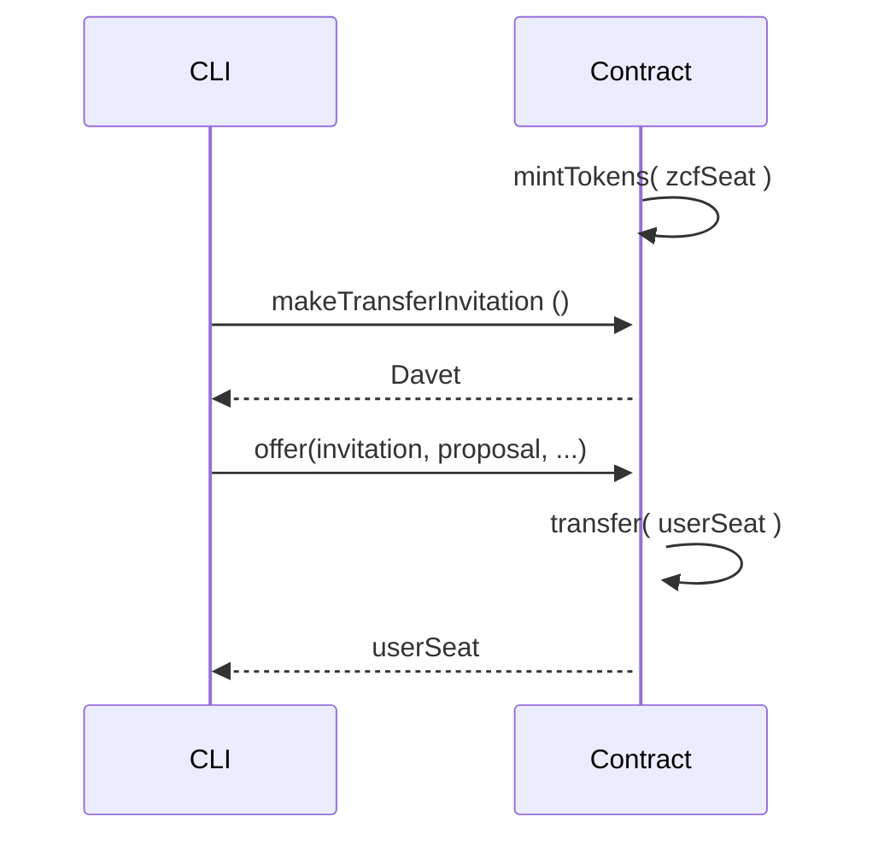

# Üçüncü Ders - Ödev

## Ödev Açıklaması:

1. Yeni bir sözleşme oluşturun;
2. Başlangıçta bazı tokenleri bir zcfSeat'e basın;
3. Basılan tokenlerden bazılarının bir userSeat'e transferine izin veren bir fonksiyon oluşturun;
4. Yukarıdaki sözleşme için yeni bir test dosyası oluşturun;

## Sıralı diyagram

