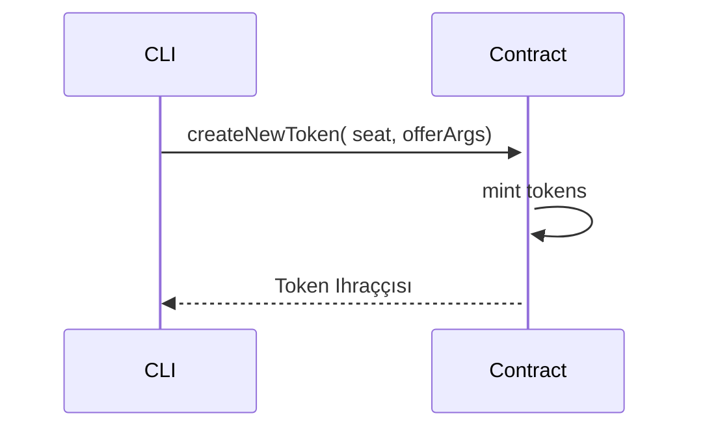

# İkinci Ders - Ödev

## Ödev Açıklaması:

1. `agoric init assignment-two` yapın. Projeye gidin, bağımlılıkları yükleyin.
2. contract.js dosyasına `createNewToken` fonksiyonunu ekleyin;
3. `createNewToken`'ı creatorFacet'e ekleyin;
4. test-contract.js'ye aşağıdaki testleri ekleyin:
    - yeni token oluştur;
    - her iki tokenin ihraççısını karşılaştır;
    - her iki tokenin miktarını karşılaştır;

## Sıralı diyagram

